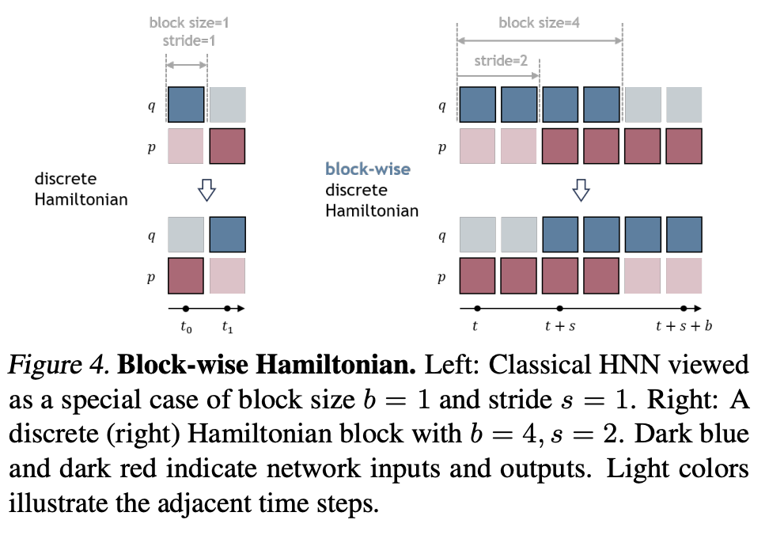
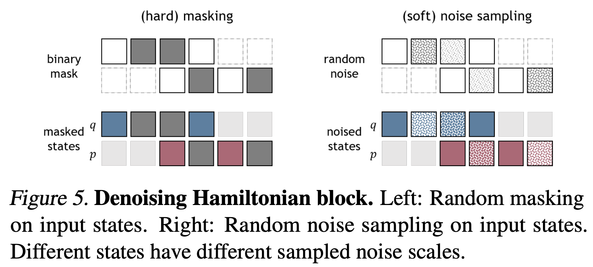

# Denoising Hamiltonian Network for Physical Reasoning

## Motivation

Goal: design more general neural operators that follow physical constraints and flexible

What physical relations can we model beyond next-state prediction ?

Approaches to model physical systems:

1. Global Analytical Solution
2. PDE + Numerical Int
3. Direct Global Relation

## Method

$$
\frac{dq}{dt} = \nabla_p H\quad \frac{dp}{dt} = -\nabla_q H
$$

HNN: minimize loss function

$$
\mathcal{L}_{HNN}(\theta)=\|\nabla_p H-\frac{dq}{dt}\|+\|\nabla_q H+\frac{dp}{dt}\|
$$

**Discrete Hamiltonian**: "right" hamiltonian, $q$ is forward and $p$ is backward

$$
q_{t+1} = q_t + \Delta t \nabla_p H(q_t,p_{t+1})\\
p_t = p_{t+1} + \Delta t \nabla_q H(q_t,p_{t+1})
$$

we can solve relation by learn network

$$
(q_{t+1},p_{t+1}) = \text{update\_rule}(q_t,p_t)
$$

Define state blocks

$$
Q_{t}^{t+b} = [q_t,q_{t+1},\dots,q_{t+b}]\\
P_{t}^{t+b} = [p_t,p_{t+1},\dots,p_{t+b}]
$$

where $b$ as block size and $s$ as block stride

$$
Q_{t+s}^{t+b+s} = \nabla_P H^+(Q_{t}^{t+b},P_{t+s}^{t+b+s})\\
P_{t}^{t+b} = \nabla_Q H^+(Q_{t}^{t+b},P_{t+s}^{t+b+s})
$$

Train block-wise discrete hamiltonian network

$$
\mathcal{L}_{block}(\theta)=\|Q_{t+s}^{t+b+s} - \nabla_P H^+_\theta(Q_{t}^{t+b},P_{t+s}^{t+b+s})\|+\|P_{t}^{t+b} - \nabla_Q H^+_\theta(Q_{t}^{t+b},P_{t+s}^{t+b+s})\|
$$

where $H^+_\theta$ is the hamiltonian network.

### Denoising Hamiltonian Network

We want the Hamiltonian blocks to not only model the state relations, but also learn the state optimization.

Define 
- noise level $\{\alpha_i\}_{i=0}^N$
- blocked input state $Q_{t}^{t+b}$
- randomly sample Gaussian noises $\mathcal{E}_{t}^{t+b}$
- per-state noise scales $A_{t}^{t+b}$
- mask $M_t^{t+b}$ (0 for unknown, 1 for known)

noised input $\tilde{Q}_{t}^{t+b}$
$$
A'=A(1-M)\\
\tilde{Q}=(1-A')Q+A'\mathcal{E}
$$

Train objective: predict $Q_{t+s}^{t+b+s}$ and $P_{t+s}^{t+b+s}$ from noised input $\tilde{Q}_{t}^{t+b}$ and $\tilde{P}_{t}^{t+b}$

## Experiments

1. Low error on energy, momentum, and position
2. Good representation (predict $\frac{l_1}{l_2}$ error)
3. Trajectory interpolation