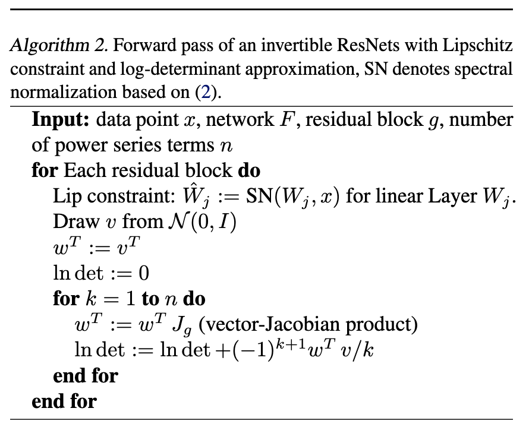

# Invertible Residual Networks

ResNet is similar as Euler's method for ODE, but it's not invertible compared to ODE. 

> Sufficient condition for invertible ResNet: Let $F_\theta=(F_\theta^1\odot F_\theta^2\odot\cdots\odot F_\theta^L)$, where $F_\theta^t=I+g_{\theta_t}$. Then $F_\theta$ is invertible if $Lip(g_{\theta_t})<1$ for all $t$.

However, we can't get analytic form of the inverse, but we can compute it by solving a fixed-point problem. Find $x$ such that $y=x+g(x)$ by interatively solving $x_{k+1}=y-g(x_k)$

> THM: $||x-x^n||_2\leq \frac{Lip(g)^n}{1-Lip(g)}||x^1-x^0||_2$
> THM: $F(x)=x+g(x)$ with $Lip(g)=L<1$ denote the residual layer. Then $Lip(F)\leq 1+L$ and $Lip(F^{-1})\leq 1/(1-L)$

Each $g_{\theta_t}$ is a convolutional neural network with contractive nonlinearity, such as ReLU. $Lip(g_{\theta_t})<1$ if $||W_i||_2<1$ for all $i$.
- How to ensure $||W_i||_2<1$? 
- Under-estimate $\tilde{\sigma}_i\leq ||W_i||_2$, if $c<\tilde{\sigma}_i$, then scale $W_i$ by $c/\tilde{\sigma}_i$.

## Generative Modelling with i-ResNet

Generative: sample $z\in\mathbb{R}^d$ from prior $p(z)$, then $x=\Phi(z)$, define $F=\Phi^{-1}$ as a i-ResNet
$$
\ln p_x(x)=\ln p_z(z)+\ln\left|\det J_F(z)\right|=\ln p_z(z)+tr(\ln J_F(z))
$$
define $F=I+g$, then
$$
tr(\ln J_F(z))=\sum_{k=1}^\infty (-1)^{k+1}\frac{1}{k}tr(J_g^k)
$$
this can be computed by

Train the model by maximizing the log-likelihood, and sample from the model by solving the fixed-point problem.