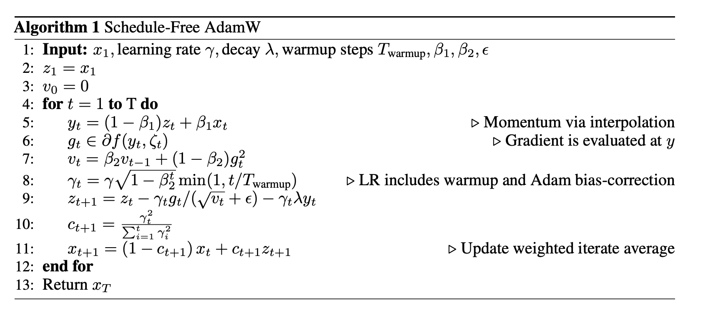

# The Road Less Scheduled

## Motivation

SGD step with size $\gamma>0$, $z_{t+1}=z_t-\gamma g_t$ where $g_t$ is the stochastic gradient at time $t$.
Classical convergence theory for convergence theory suggests that expected loss of this $z$ sequence is suboptimal, the PR average is better
$$
z_{t+1}=z_t-\gamma g_t\\
x_{t+1}=(1-c_{t+1})x_t+c_{t+1}z_{t+1}
$$
where using $c_{t+1}=\frac{1}{t+1}$ results in $x_t=\frac{1}{t}\sum_{i=1}^t z_i$.

This gives better theoretical convergence properties, but in practice, the former is better.

__Can we have the best of both worlds?__

## Method

### Schedule-free SGD

define $x$ as evaluation sequence, $y$ as gradient location sequence, and $z$ as base sequence. The update rule is

$$
y_t=(1-\beta)z_t+\beta x_t\\
z_{t+1}=z_t-\gamma\nabla f(y_t, \xi_t)\\
x_{t+1}=(1-c_{t+1})x_t+c_{t+1}z_{t+1}
$$

where $\xi_t$ is the random variable at time $t$, $\nabla f(y_t, \xi_t)$ is unbiased estimator of $\nabla f(y_t)$.

Advantages:
1. Theoretical guarantees: both for $\gamma\varpropto\frac{1}{\sqrt{T}}$ and constant $\gamma$.
2. Compared to EMA, consider a immediate large gradient $g_t$, then EMA will absorb this gradient in $~10$ steps when $\beta=0.9$, while the proposed method will absorb it in more steps, which is more stable.
3. Compared to setting $\beta=1$ (Primal Average), the proposed method converges faster.

### Schedule-free AdamW

