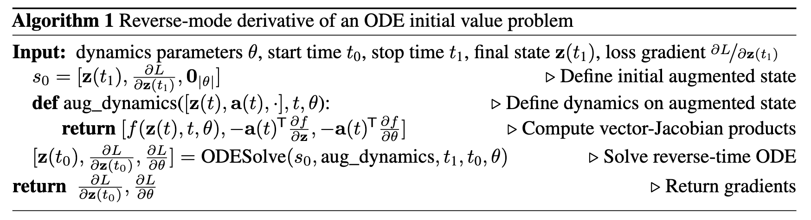
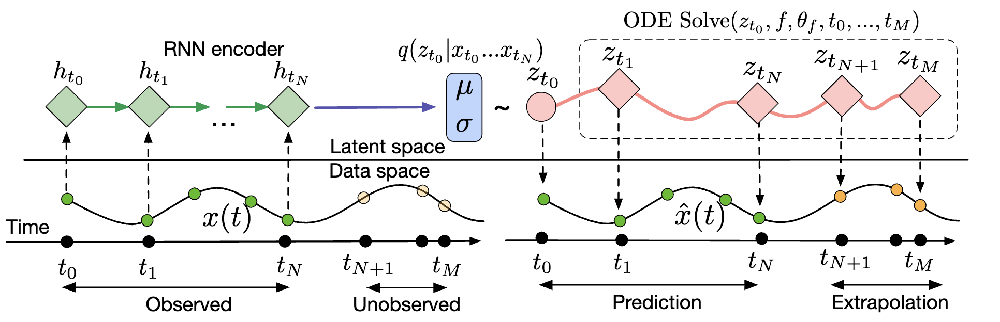

# Neural ODE

## Motivation

ResNet can be viewed as
$$
h_{t+1}=h_t+f(h_t,\theta)
$$
where $f$ is a neural network with parameters $\theta$. The forward Euler discretization of ODE
$$
\frac{dh(t)}{dt}=f(h(t),\theta,t)
$$
We can define and evaluate model using ODE solver

## Reverse-mode automatic differentiation of ODE solutions

To optimize a scalar-valued loss $L$
$$
L(z(t_1))=L\left(z(t_0)+\int_{t_0}^{t_1}f(z(t),t,\theta)dt\right)=L(ODESolve(z(t_0),f,t_0,t_1,\theta))
$$
we need to track adjoint $a(t)=\frac{\partial L}{\partial z(t)}$, which follows
$$
\frac{da(t)}{dt}=-a(t)^T\nabla_z f(z(t),t,\theta)
$$
We can compute $\frac{\partial L}{\partial z(t_0)}$ by calling another ODE solver with initial condition $a(t_1)$. We can backpropagate $z$ and $a$ together wo store $z$
$$
\frac{dL}{d\theta}=-\int_{t_1}^{t_0}a(t)^T\nabla_{\theta}f(z(t),t,\theta)dt
$$

Use Neural ODE to replace ResNet can achieve similar performance with $O(1)$ memory cost on MNIST

## Continuous normalizing flows

For normalizing flow, $x=f(z)$, then
$$
p(x)=p(z)\left|\det\left(\frac{df^{-1}(x)}{dx}\right)\right|\to \log p(x)=\log p(z)-\log\left|\det\left(\frac{df(z)}{dz}\right)\right|
$$
for continuous-in-time transformation of $z(t)$, we have
$$
\frac{dz(t)}{dt}=f(z(t),t)
$$
then
$$
\frac{d\log p(z(t))}{dt}=-tr\left(\frac{df(z(t),t)}{dz}\right)
$$
Continuous normalizing flow: define $dz(t)/dt=\sum_n \sigma_n(t)f_n(z)$, then
$$
\frac{d\log p(z(t))}{dt}=-\sum_n \sigma_n(t)tr\left(\frac{df_n(z)}{dz}\right)
$$
> THM: a plannar CNF with $M$ hidden units can be at least as expressive as a planar NF with $M$ layers

## Generative Latent function time-series model

Sample $z_{t_0}\sim p(z_{t_0})$, then
$$
z_{t_1},z_{t_2},\cdots,z_{t_N}=ODESolve(z_{t_0},f,\theta, t_0,\cdots,t_N)\\
x_{t_i}\sim p(x|z_{t_i},\theta_x)
$$

Train process:
1. Run RNN encoder condition on $\{x_{t_i},t_i\}$ to get posterior over $z_{t_0}$
2. sample $z_{t_0}$ and run ODE solver to get $z_{t_i}$
3. Maximize ELBO