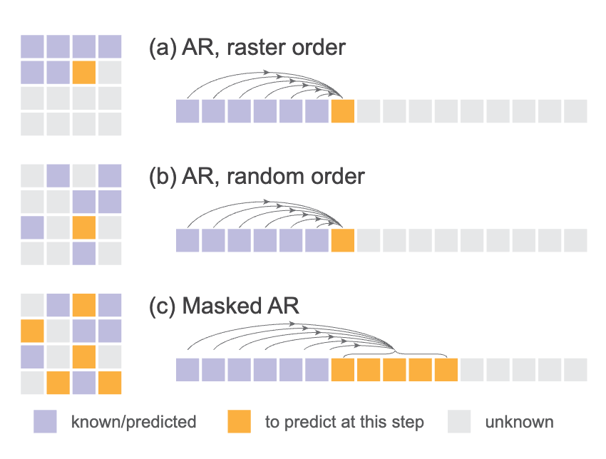

# Autoregressive Image Generation wo VQ

## Motivation

**Is VQ necessary for autoregressive image generation?**

In order to answer this question, we need to answer the following questions:
Why VQ is first introduced in AR image generation? What is the paradigm of AR image generation?

In latent space, with a discrete tokenizer, $x$ can be represented as an integer $0\leq x< K$, with a vocabulary size $K$. Then condition on feature vector $z$, the probability of $x$ is given by $p(x|z) = \text{softmax}(Wz)$.

With VQ, we actually modeling the probability of next token $x$ using categorical distribution. We find that Diffusion models can also model the probability of next token $x$ using a continuous distribution.

## Method

### Train

Consider continuous-valued vector $x\in\mathbb{R}^d$, the loss of $p(x|z)$ can be formulated as a denoising criterion

$$
\mathcal{L}(z,x)=\mathbb{E}_{\epsilon,t}\left[\left\|\epsilon-\epsilon_\theta(x_t|t,z)\right\|^2\right]
$$

where $x_t=\sqrt{\overline{\alpha_t}}x+\sqrt{1-\overline{\alpha_t}}\epsilon$, where $z$ is produced from $f$.

How can we train $f$ ? Backpropgate from $\epsilon_\theta$. When generation autoregressively

$$
p(x^1,\dots,x^n)=\prod_{i=1}^n p(x^i|x^1,\dots,x^{i-1})=\prod_{i=1}^n p(x^i|z^i=f(x^1,\dots,x^{i-1}))
$$

hence

$$
\mathcal{L}(x)=\mathbb{E}_{\epsilon,t,i}\left[\left\|\epsilon-\epsilon_\theta(x_t^i|t,f(x^1,\dots,x^{i-1}))\right\|^2\right]
$$

### Inference

At inference time, we only need to done a reverse diffusion procedure

$$
x_{t-1}=\frac{1}{\sqrt{\alpha_t}}\left(x_t-\frac{1-\alpha_t}{\sqrt{1-\overline{\alpha}_t}}\epsilon_\theta(x_t|t,z)\right)+\sigma_t \delta\quad \delta\sim\mathcal{N}(0,I)
$$

where $z$ is produced from $f$. 

Can we control sample diversity using temperature $\tau$ ? In common context, temperature $\tau$ means sample from $p(x|z)^{1/\tau}$, i.e. the score function is $\frac{1}{\tau}\nabla\log_x p(x|z)$. 
Hence, divide $\epsilon_\theta$ by $\tau$ or scale the noise by $\tau$ works well.

In fact, we apply autoregressive in random orders or using masked AR

