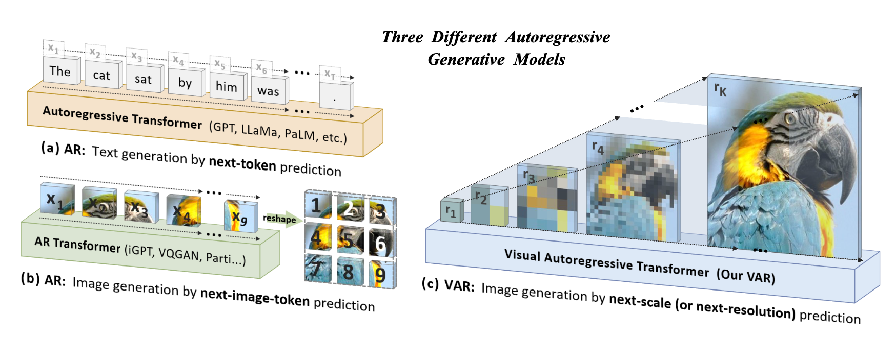

# Visual Autoregressive Modeling: Scalable Image Generation via Next-Scale Prediction

## Motivation

Standard AR generation, like GPT, LLaMa, PaLM, generate text by next-token prediction, but image generation hard to define order.

Hence propose VAR, generate image by next-scale prediction. AR is defined on scale

## Review

Let's review AR via next prediction first, given an image, the feature $f$ and discrete tokens $q$ is computed by

$$
f=\mathcal{E}(im), q=Q(f)
$$

where $\mathcal{E}$ is encoder and $Q$ is quantizer

$$
q^{(i,j)}=\arg\min_{v\in V}\|\text{lookup}(Z,v)-f^{(i,j)}\|
$$

where $Z$ is codebook, $V$ is vocabulary. We can reconstruct image by

$$
\hat{f}=\sum_{i,j}\text{lookup}(Z,q^{(i,j)})\quad \hat{im}=\mathcal{D}(\hat{f})
$$

The loss is defined as

$$
\mathcal{L}=\|im-\hat{im}\|_2+\|f-\hat{f}\|_2+\lambda_p\mathcal{L}_p(\hat{im})+\lambda_G\mathcal{L}_G(\hat{im})
$$

where $\mathcal{L}_p$ is perceptual loss, $\mathcal{L}_G$ is GAN loss.

What is the problem of AR image generation? 
- Can't model bidirectional correlation
- Inability to perform some zero-shot generalization. Like impainting given bottom part
- Lose spatial relationship since flatten image to 1D
- Inefficient, $O(n^6)$ complexity for $n\times n$ image tokens

## Method

Quantize image into $K$ multi-scale token maps, $(r_1,r_2,\dots,r_K)$. The AR likelihood is defined as

$$
p(r_1,r_2,\dots,r_K)=\prod_{k=1}^K p(r_k|r_1,\dots,r_{k-1})
$$

how to form $p(r_k|r_1,\dots,r_{k-1})$ ? 

1. Use Multi-scale VQVAE encoding and reconstruction to get all tokens $r_k$

2. Train a transformer to do next-scale prediction, i.e. predict $r_k$ given $r_1,\dots,r_{k-1}$ using cross-entropy loss

During generation, we generation all tokens of $r_k$ in parallel. $r_1$ is generated from $[s]$, which contains label information.

### Zero-shot task generalization

Image in-painting and out-painting: generate tokens within the mask.

Class-conditional image editing: generate tokens only in the bounding box conditioned on class label.