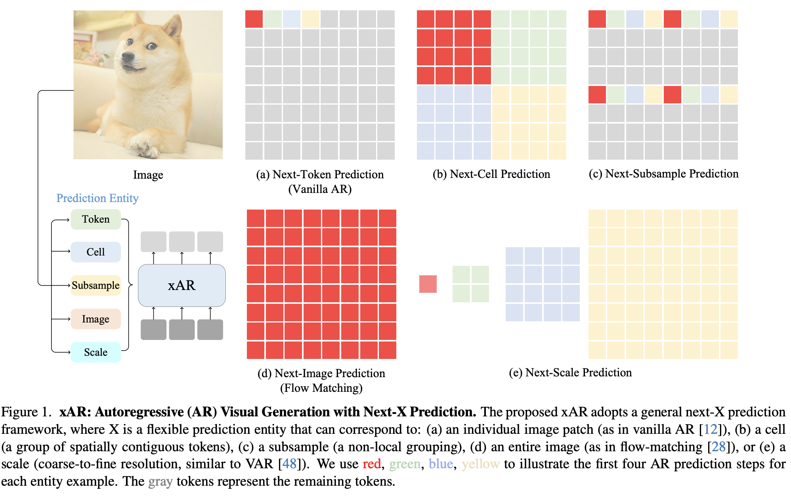

# Next-X Prediction for AR

TLDR: use different prediction entities and train model with noisy data to improve robustness.

## Method

Construct a sequence of prediction entities $X=\{X_1,X_2,...,X_N\}$, each $X_i$ can be __token, cell, subsample, scale, entire image__

We use flow matching objective, random sample $n$ noise time steps $\{t_1,...,t_n\}$, and $n$ noise samples $\epsilon_1,...,\epsilon_n$, define
$$
F_n^{t_n}=(1-t_n)X_n+t_n\epsilon_n
$$
we aims to predict $V_n^{t_n}=\epsilon_n-X_n$ given $F_1^{t_1},...,F_n^{t_n}$, i.e. minimize loss
$$
\sum_{n=1}^N\|xAR(\{F_1^{t_1},...,F_n^{t_n}\},t_n;\theta)-V_n^{t_n}\|^2
$$

by condition on noisy image, we can improve robustness of model.

During inference, use clean image to predict $V_n^{t_n}$.