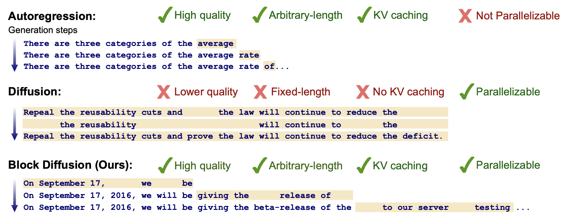
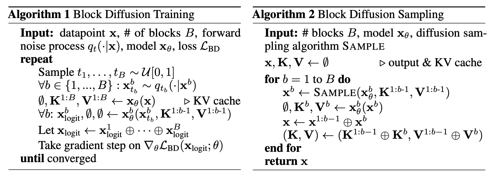

# Block Diffusion

## Motivation

TLDR: Combine AR and Diffusion together.

## Method

Group tokens in $x$ into $B$ blocks, each length $L'$.

$$
\log p_\theta(x) = \sum_{b=1}^B \log p_\theta(x^b|x^{<b})
$$

each $p_\theta(x^b|x^{<b})$ is defined by discrete diffusion

$$
p_\theta(x_s^b|x_t^b,x^{<b}) = \sum_{x^b} q(x_s^b|x_t^b,x^b) p_\theta(x^b|x_t^b,x^{<b})
$$

where $s=s(j)=\frac{j-1}{T}$ denotes the time step preceding $t=t(j)=\frac{j}{T}$.

Forward process $q(x_t^l|x_s^l)=\text{Categorical}(x_t^l;Q_t x_s^l)$, where $Q_t$ is the diffusion matrix. We can compute $q(x_s^b|x_t^b,x^{<b})$ similar to reverse process in DDIM.

### Loss

$$
-\log p_\theta(x) \leq \mathcal{L}_{BD}(x;\theta) = \sum_{b=1}^B \mathcal{L}(x^b|x^{<b};\theta)
$$

where $\mathcal{L}(x^b|x^{<b};\theta)$ is NELBO, i.e.

$$
\mathcal{L}(x^b|x^{<b};\theta) = \mathbb{E}_{q}\left[-\log p_\theta(x^b|x^b_{t(1)},x^{<b})+\sum_{j=1}^{T-1} D_{KL}[q(x^b_{s(j)}|x^b_{t(j)},x^b)||p_\theta(x^b_{s(j)}|x^b_{t(j)},x^{<b})]+D_{KL}[q(x_{t(T)}|x)||p_\theta(x_{t(T)}|x^{<b})]\right]
$$

## Discussions

How to define forward process ? Mask

$$
q(x_t^l|x^l) = \text{Categorical}(x_t^l;\alpha_t x^l+(1-\alpha_t) m)
$$

where $m$ is the mask, $\alpha_t$ is the diffusion coefficient

$$
-\log p_\theta(x) \leq \mathcal{L}_{BD}(x;\theta) = \sum_{b=1}^B \mathbb{E}_{t\sim [0,1]}\mathbb{E}_q \frac{\alpha_t'}{1-\alpha_t} \log p_\theta(x^b|x_t^b,x^{<b})
$$

Smaller $L'$ gives tighter bound