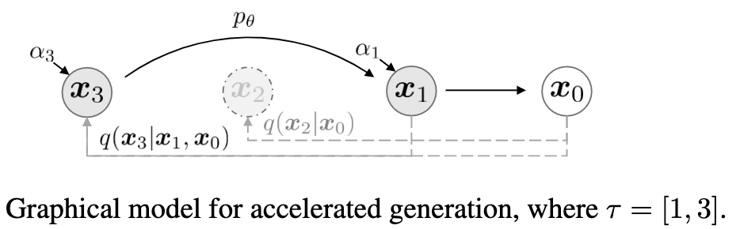

# DDIM

## Motivation

DDPM generates samples by iteratively denoising a noise-corrupted image, which is computationally expensive.

Can we learn a model that directly generates samples without the need for iterative denoising?
__Non-Markovian Forward Process__

## Method

### Non-Markovian Forward Process

Consider distributions family $\mathcal{Q}$ indexed by $\sigma$

$$
q_\sigma(x_{1:T}|x_0)=q_\sigma(x_T|x_0)\prod_{t=2}^T q_\sigma(x_{t-1}|x_{t},x_0)
$$

in order to satisfy $q_\sigma(x_t|x_0)=\mathcal{N}(x_t;\sqrt{\overline{\alpha}_t}x_0,(1-\overline{\alpha}_t) I)$, corresponding $q_\sigma(x_{t-1}|x_{t},x_0)$ should satisfy

$$
% q_\sigma(x_T|x_0)=\mathcal{N}(x_T;\sqrt{\overline{\alpha}_T}x_0,(1-\overline{\alpha}_T) I)\\
q_\sigma(x_{t-1}|x_{t},x_0)=\mathcal{N}\left(\sqrt{\overline{\alpha}_{t-1}}x_{0}+\sqrt{1-\overline{\alpha}_{t-1}-\sigma_t^2}\frac{x_t-\sqrt{\overline{\alpha}_t}x_0}{\sqrt{1-\overline{\alpha}_t}},\sigma_t^2 I\right)
$$

note: if we set $\sigma_t^2=\frac{1-\overline{\alpha}_{t-1}}{1-\overline{\alpha}_{t}}\beta_t$, we get DDPM.

Q: Why in this situation, $q_\sigma(x_{t-1}|x_{t},x_0)$ has free parameters $\sigma_t$?
A: Because the forward process is __non-Markovian__, we only define $q_\sigma(x_t|x_0)$ here, instead of defining $q_\sigma(x_t|x_{t-1})$ in DDPM.
In fact, only $q_\sigma(x_t|x_0)$ is useful, as our training process doesn't actually get $x_t$ using $x_{t-1}$, but directly from $x_0$.
Inspired by [XIBO](https://jzc-2007.github.io/), we find that arbitrary joint distribution of $(x_0,x_1,...,x_T)$ is valid, as long as $q_\sigma(x_t|x_0)$ is correct. __We only care about marginal distribution__. Once $q_\sigma(x_t|x_0)$ is correct, we can define any forward process, as well as its corresponding reverse process.

Back to the question, we can also define forward process

$$
q_\sigma(x_t|x_{t-1},x_0)=\frac{q_\sigma(x_{t-1}|x_{t},x_0)q_\sigma(x_t|x_0)}{q_\sigma(x_{t-1}|x_0)}
$$

which is also a Gaussian

### Generative Process

Since our forward process is __non-Markovian__, our backward process $q_\sigma(x_{t-1}|x_t,x_0)$ also depends on $x_0$. We want to learn a model $p_\theta(x_{t-1}|x_t)$ such that $p_\theta(x_{0:T})$ is close to $q_\sigma(x_{0:T}|x_0)$.
How can we leverage knowledge provided by $q_\sigma(x_{t-1}|x_t,x_0)$ ? Intuitively, if we can predict $x_0$ from $x_t$, then apply reverse conditional distribution $q_\sigma(x_{t-1}|x_t,x_0)$, we can get $x_{t-1}$.

For $x_0\sim q(x_0),\epsilon\sim\mathcal{N}(0,I)$, we can generate noise samples by

$$
x_t=\sqrt{\overline{\alpha}_t}x_0+\sqrt{1-\overline{\alpha}_t}\epsilon
$$

Our model $\epsilon_\theta(x_t,t)$ aims to predict $\epsilon$ given $x_t$ and $t$, our prediction of $x_0$ is

$$
f_\theta(x_t,t)=\frac{x_t-\sqrt{1-\overline{\alpha}_t}\epsilon_\theta(x_t,t)}{\sqrt{\overline{\alpha}_t}}
$$

then our generative process with fixed prior $p_\theta(x_T)\sim\mathcal{N}(x_T;0,I)$ is

$$
p_\theta^{(t)}(x_{t-1}|x_t)=\left\{\begin{aligned}
&q_\sigma(x_{t-1}|x_{t},f_\theta(x_t,t)),\quad t>1\\
&\mathcal{N}\left(x_{t-1};f_\theta(x_1,1),\sigma_1^2 I\right),\quad t=1
\end{aligned}\right.
$$

We want to learn $\theta$ such that $p_\theta(x_{0:T})$ is close to $q_\sigma(x_{0:T}|x_0)$, using KL divergence

$$
J_\sigma(\epsilon_\theta)=\mathbb{E}_{x_{0:T}\sim q_\sigma(x_{0:T})}\left[\log\frac{q_\sigma(x_{0:T}|x_0)}{p_\theta(x_{0:T})}\right]\\
=\mathbb{E}_{x_{0:T}\sim q_\sigma(x_{0:T})}\left[\log q_\sigma(x_T|x_0)+\sum_{t=2}^T\log q_\sigma(x_{t-1}|x_t,x_0)-\log p_\theta(x_T)-\sum_{t=1}^T\log p_\theta^{(t)}(x_{t-1}|x_t)\right]\\
=\mathbb{E}_{x_{0:T}\sim q_\sigma(x_{0:T})}\left[\sum_{t=2}^T\left(\log q_\sigma(x_{t-1}|x_t,x_0)-\log p_\theta^{(t)}(x_{t-1}|x_t)\right)-\log p_\theta^{(1)}(x_{0}|x_1)\right]+C_\sigma\\
=\sum_{t=2}^T\mathbb{E}_{x_0,x_t\sim q_\sigma(x_0,x_t)}\left[D_{KL}\left(q_\sigma(x_{t-1}|x_t,x_0)||p_\theta^{(t)}(x_{t-1}|x_t)\right)\right]-\mathbb{E}_{x_0,x_1\sim q_\sigma(x_0,x_1)}\left[\log p_\theta^{(1)}(x_{0}|x_1)\right]+C_\sigma\\
=\sum_{t=2}^T\mathbb{E}_{x_0,x_t\sim q_\sigma(x_0,x_t)}\left[D_{KL}\left(q_\sigma(x_{t-1}|x_t,x_0)||q_\sigma(x_{t-1}|x_{t},f_\theta(x_t,t))\right)\right]-\mathbb{E}_{x_0,x_1\sim q_\sigma(x_0,x_1)}\left[\log p_\theta^{(1)}(x_{0}|x_1)\right]+C_\sigma\\
=\sum_{t=1}^T\mathbb{E}_{x_0\sim q(x_0),\epsilon\sim\mathcal{N}(0,I),x_t=\sqrt{\overline{\alpha}_t}x_0+\sqrt{1-\overline{\alpha}_t}\epsilon}\left[\frac{1-\overline{\alpha}_t}{2\overline{\alpha}_t\sigma_t^2}\|\epsilon-\epsilon_\theta(x_t,t)\|^2\right]+C_\sigma
$$

where $C_\sigma$ is constant w.r.t. $\epsilon_\theta$. By defining $\gamma_t=\frac{1-\overline{\alpha}_t}{2\overline{\alpha}_t\sigma_t^2}$

$$
J_\sigma(\epsilon_\theta)=\sum_{t=1}^T\gamma_t\mathbb{E}_{x_0\sim q(x_0),\epsilon\sim\mathcal{N}(0,I)}\left[\|\epsilon_\theta(\sqrt{\overline{\alpha}_t}x_0+\sqrt{1-\overline{\alpha}_t}\epsilon,t)-\epsilon\|^2\right]+C_\sigma=L_\gamma(\epsilon_\theta)+C_\sigma
$$

__The formula above shows the objective $J_\sigma$ is equivalent to minimizing the expected squared error between the predicted noise and the true noise, which is the same as DDPM.__

*THM: For all $\sigma>0$, there exists $\gamma\in\mathbb{R}^T_{>0}$ and $C\in\mathbb{R}$ such that $J_\sigma(\epsilon_\theta)=L_\gamma(\epsilon_\theta)+C$.*

Q: What does the formula imply?
A: If parameter is not shared across $t$, then optimal sol of $L_\gamma$ doesn't depend on $\gamma$, hence for all $\sigma>0$, the optimal sol of $J_\sigma$ is the same. Hence, we can use a pretrained DDPM model, then choose better $\sigma$.

### Sampling from Generalized Generative Process

Naive sample generation: sample $x_T\sim\mathcal{N}(0,I)$, then denoise by

$$
x_{t-1}=\sqrt{\overline{\alpha}_{t-1}}\frac{x_t-\sqrt{1-\overline{\alpha}_t}\epsilon_\theta(x_t,t)}{\sqrt{\overline{\alpha}_t}}+\sqrt{1-\overline{\alpha}_{t-1}-\sigma_t^2}\epsilon_\theta(x_t,t)+\sigma_t\epsilon\quad \epsilon\sim\mathcal{N}(0,I)
$$

DDIM: choose $\sigma_t=0$, forward and backward process become deterministic, only trained with DDPM objective.

How to accelerate sampling process? Once $q_\sigma(x_t|x_0)$ is fixed, denoising objective $J_\sigma$ doesn't depend on forward process, we only need to match marginal distribution.

Hence we can choose $\tau$ which is an increasing sub-sequence of $1:T$ of length $S$, then only consider forward process on $\{x_{\tau_i}\}_{i=1}^S$ s.t. $q_\sigma(x_{\tau_i}|x_0)=\mathcal{N}(x_{\tau_i};\sqrt{\overline{\alpha}_{\tau_i}}x_0,(1-\overline{\alpha}_{\tau_i})I)$

### Relation to ODE

In DDIM, our denoising process is

$$
x_{t-1}=\sqrt{\overline{\alpha}_{t-1}}\frac{x_t-\sqrt{1-\overline{\alpha}_t}\epsilon_\theta(x_t,t)}{\sqrt{\overline{\alpha}_t}}+\sqrt{1-\overline{\alpha}_{t-1}}\epsilon_\theta(x_t,t)
$$

define $\overline{x}=\frac{x}{\overline{\alpha}},\sigma=\frac{1-\overline{\alpha}}{\overline{\alpha}}$, continuous-time limit is

$$
\text{d}\overline{x}(t)=\epsilon_\theta\left(\frac{x}{\sigma^2+1},t\right)\text{d}\sigma(t)
$$

we can start from $x(T)\sim\mathcal{N}(0,\sigma(T))$, then compute $x(0)$