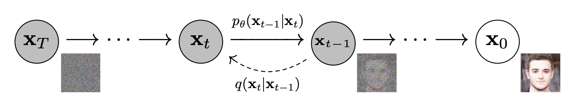

# DDPM

## Background and Motivation

Formulate diffusion process as Markov chain: define $x_0\sim q(x_0)$ as image, $x_T\sim\mathcal{N}(x_T;0,I)$ as noise.

Given Forward dynamics

$$
q(x_t|x_{t-1})=\mathcal{N}(x_t;\sqrt{1-\beta_t}x_{t-1},\beta_t I)
$$

we want to learn reverse transition dynamics $p_\theta(x_{t-1}|x_t)$, starting from noise $x_T$

$$
p_\theta(x_{0:T})=p(x_T)\prod_{t=1}^T p_\theta(x_{t-1}|x_t)\quad p_\theta(x_0)=\int p_\theta(x_{0:T})dx_{1:T}
$$

such that $p_\theta(x_0)$ is close to $q(x_0)$.

## Math Formulation

It's easy to compute all forward distributions $q(x_t|x_0)$ by iteratively applying forward dynamics ($\alpha_t=1-\beta_t,\overline{\alpha}_t=\prod_{i=1}^t\alpha_i$)

$$
q(x_t|x_0)=\mathcal{N}(x_t;\sqrt{\overline{\alpha}_t}x_0,(1-\overline{\alpha}_t) I)
$$

What is $p(x_{t-1}|x_t)$ under $q$ ? We need to compute posterior

$$
p(x_{t-1}|x_t)=\int p(x_{t-1}|x_t,x_0) p(x_0|x_t)dx_0
$$

We can show $p(x_{t-1}|x_t,x_0)$ is __Gaussian__

$$
p(x_{t-1}|x_t,x_0)=\frac{p(x_t|x_{t-1},x_0)p(x_{t-1}|x_0)}{p(x_t|x_0)}\\
\propto \exp\left(-\frac{1}{2\beta_t}\|x_t-\sqrt{1-\beta_t}x_{t-1}\|^2-\frac{1}{2(1-\overline{\alpha}_{t-1})}\|x_{t-1}-\sqrt{\overline{\alpha}_{t-1}}x_0\|^2+\frac{1}{2(1-\overline{\alpha}_t)}\|x_t-\sqrt{\overline{\alpha}_t}x_0\|^2\right)\\
=\exp\left(-\frac{1}{2}\left(\left(\frac{1-\beta_t}{\beta_t}+\frac{1}{1-\overline{\alpha}_{t-1}}\right)x_{t-1}^2-2\left(\frac{\sqrt{1-\beta_t}}{\beta_t}x_t+\frac{\sqrt{\overline{\alpha}_{t-1}}}{1-\overline{\alpha}_{t-1}}x_0\right)x_{t-1}+f(x_t,x_0)\right)\right)
$$

which means $p(x_{t-1}|x_t,x_0)=\mathcal{N}(x_{t-1};\tilde{\mu}_t(x_t,x_0),\tilde{\beta}_t)$, where

$$
% \tilde{\mu}_t(x_t,x_0)=\frac{\sqrt{1-\beta_t}}{1-\overline{\alpha}_{t-1}}x_t+\frac{\sqrt{\overline{\alpha}_{t-1}}}{1-\overline{\alpha}_{t-1}}x_0\\
\tilde{\beta}_t=\left(\frac{1-\beta_t}{\beta_t}+\frac{1}{1-\overline{\alpha}_{t-1}}\right)^{-1}=\frac{1-\overline{\alpha}_{t-1}}{1-\overline{\alpha}_{t}}\beta_t\\
\tilde{\mu}_t(x_t,x_0)=\tilde{\beta}_t\left(\frac{\sqrt{1-\beta_t}}{\beta_t}x_t+\frac{\sqrt{\overline{\alpha}_{t-1}}}{1-\overline{\alpha}_{t-1}}x_0\right)=\frac{\sqrt{\overline{\alpha}_{t-1}}\beta_t}{1-\overline{\alpha}_{t}}x_0+\frac{\sqrt{\alpha_t}(1-\overline{\alpha}_{t-1})}{1-\overline{\alpha}_{t}}x_t
$$

and $p(x_0|x_t)$ is computed by Bayes' rule

$$
p(x_0|x_t)\propto q(x_t|x_0)q(x_0)
$$

hence

$$
p(x_{t-1}|x_t)\propto\int p(x_{t-1}|x_t,x_0) q(x_t|x_0)q(x_0)dx_0\\
\propto\sum_{x_0} \mathcal{N}(x_{t-1};\tilde{\mu}_t(x_t,x_0),\tilde{\beta}_t)\mathcal{N}(x_t;\sqrt{\overline{\alpha}_t}x_0,(1-\overline{\alpha}_t) I)
$$

We can approx $p(x_{t-1}|x_t)$ as Convolution of two Gaussians, which is also __Gaussian__, hence we try to use $p_\theta(x_{t-1}|x_t)=\mathcal{N}(x_{t-1};\mu_\theta(x_t,t),\Sigma_\theta(x_t,t))$ to fit $p(x_{t-1}|x_t)$

In DDPM, for simplicity, we use $\Sigma_\theta(x_t,t)=\sigma_t^2 I$ to untrained time dependent constants. $\sigma_t^2=\beta_t$ or $\tilde{\beta}_t$ both work well.

choice of $\mu_\theta(x_t,t)$ is __critical__ to model performance, theoretically

$$
\mu_\theta(x_t,t)\leftarrow \tilde{\mu}_t(x_t,t)=\mathbb{E}_{x_{t-1}\sim p(x_{t-1}|x_t)}[x_{t-1}]\\
=\mathbb{E}_{x_0\sim p(x_0|x_t)}\mathbb{E}_{x_{t-1}\sim p(x_{t-1}|x_t,x_0)}[x_{t-1}]=\mathbb{E}_{x_0\sim p(x_0|x_t)}[\tilde{\mu}_t(x_t,x_0)]\\=\frac{\sqrt{\overline{\alpha}_{t-1}}\beta_t}{1-\overline{\alpha}_{t}}\mathbb{E}_{x_0\sim p(x_0|x_t)}[x_0]+\frac{\sqrt{\alpha_t}(1-\overline{\alpha}_{t-1})}{1-\overline{\alpha}_{t}}x_t
$$

**The model is predicting $\mathbb{E}_{x_0\sim p(x_0|x_t)}[x_0]$ in fact**, we can conclude it as __posterior average__.

## Diffusion models and Denoising AE

Now, we want to learn a model $p_\theta(x_{t-1}|x_t)$ to approx $p(x_{t-1}|x_t)$, a natural choice is to use KL divergence

$$
\mathcal{L}_{t-1}=\mathbb{E}_{x_0,x_t\sim q(x_0,x_t)}\left[D_{KL}\left(q(x_{t-1}|x_t,x_0)||p_\theta(x_{t-1}|x_t)\right)\right]
$$

Since $\sigma_t$ is fixed parameter, we can rewrite the objective as

$$
L_{t-1}=\mathbb{E}_{x_0\sim q(x_0),x_t\sim q(x_t|x_0)}\left[\frac{1}{2\sigma_t^2}\|\tilde{\mu}_t(x_t,x_0)-\mu_\theta(x_t,t)\|^2\right]\\
=\mathbb{E}_{x_0\sim q(x_0),x_t\sim \mathcal{N}(x_t;\sqrt{\overline{\alpha}_t}x_0,(1-\overline{\alpha}_t) I)}\left[\frac{1}{2\sigma_t^2}\|\tilde{\mu}_t(x_t,x_0)-\mu_\theta(x_t,t)\|^2\right]
$$

equal to fit $\mu_\theta(x_t,t)$ into $\tilde{\mu}_t(x_t,t)$, we are predicting __posterior average__.

By using reparameterization trick, as well as representing $x_0$ using $x_t(x_0,\epsilon)=\sqrt{\overline{\alpha}_t}x_0+\sqrt{1-\overline{\alpha}_t}\epsilon$, we can simplify the objective

$$
L_{t-1}=\mathbb{E}_{x_0\sim q(x_0),\epsilon\sim\mathcal{N}(0,I)}\left[\|\tilde{\mu}_t(x_t(x_0,\epsilon),\frac{1}{\sqrt{\alpha_t}}\left(x_t(x_0,\epsilon)-\sqrt{1-\overline{\alpha}_t}\epsilon\right))-\mu_\theta(x_t(x_0,\epsilon),t)\|^2\right]\\
=\mathbb{E}_{x_0\sim q(x_0),\epsilon\sim\mathcal{N}(0,I)}\left[\frac{1}{\sqrt{{\alpha}_t}}\left(x_t(x_0,\epsilon)-\frac{\beta_t}{\sqrt{1-\overline{\alpha}_t}}\epsilon\right)-\mu_\theta(x_t(x_0,\epsilon),t)\right]^2\\
% =\mathbb{E}_{x_0\sim q(x_0),\epsilon\sim\mathcal{N}(0,I)}\left[\frac{1}{\sqrt{\overline{\alpha}_t}}\left(

% \right)\right]
$$

an optimal $\mu_\theta$ should satisfy for any $x_0\sim q(x_0),\epsilon\sim\mathcal{N}(0,I)$

$$
\mu_\theta\left(\sqrt{\overline{\alpha}_t}x_0+\sqrt{1-\overline{\alpha}_t}\epsilon\right)=\frac{1}{\sqrt{{\alpha}_t}}\left(\left(\sqrt{\overline{\alpha}_t}x_0+\sqrt{1-\overline{\alpha}_t}\epsilon\right)-\frac{\beta_t}{\sqrt{1-\overline{\alpha}_t}}\epsilon\right)
$$

we only need to predict __residue__ part, denote as 

$$
\epsilon_\theta(x_t,t)=\frac{\sqrt{1-\overline{\alpha}_t}}{\beta_t}\left(x_t-\sqrt{\alpha}_t\mu_\theta(x_t,t)\right)
$$

the corresponding loss is

$$
L_{t-1}=\mathbb{E}_{x_0\sim q(x_0),\epsilon\sim\mathcal{N}(0,I)}\left[\frac{\beta_t^2}{2\sigma_t^2\alpha_t(1-\overline{\alpha}_t)}\|\epsilon_\theta(x_t(x_0,\epsilon),t)-\epsilon\|^2\right]
$$

hence we get our __Training__ and __Sampling__ Procedure

$$
\textbf{Train}: \nabla_\theta\|\epsilon_\theta(\sqrt{\overline{\alpha}_t}x_0+\sqrt{1-\overline{\alpha}_t}\epsilon,t)-\epsilon\|^2\quad x_0\sim q(x_0),\epsilon\sim\mathcal{N}(0,I),t\sim \text{Uni}[0,T]
\\
\textbf{Sample}: x_{t-1}=\mu_\theta(x_t,t)+\sigma_t z=\frac{1}{\sqrt{\alpha_t}}\left(x_t-\frac{1-\alpha_t}{\sqrt{1-\overline{\alpha}_t}}\epsilon_\theta(x_t,t)\right)+\sigma_t z\quad z\sim\mathcal{N}(0,I)
$$

which is same to Paper's Algorithm 1 and 2.

## Improved DDPM

Simple modification to DDPM can improve performance, using following ways
1. We can prove that the upper bound and lower bound of variance of $p(x_{t-1}|x_t)$ is $\beta_t$ and $\tilde{\beta}_t$ respectively. Hence, instead of setting $\Sigma_\theta(x_t,t)=\sigma_t^2 I$ with fixed $\sigma_t$, ask our model output $v$ containing one component per dimension, and 
$$
\Sigma_\theta(x_t,t)=\exp(v\log\beta_t+(1-v)\log\tilde{\beta}_t)
$$
2. To avoid too much noise, apply cosine noise schedule
$$
\overline{\alpha}_t=\frac{f(t)}{f(0)}\quad f(t)=\cos\left(\frac{t/T+s}{1+s}\frac{\pi}{2}\right)^2\quad \beta_t=1-\frac{\overline{\alpha}_t}{\overline{\alpha}_{t-1}}
$$
3. How to train $\Sigma_\theta(x_t,t)$ ? Our loss is in fact a KL divergence
$$
\mathcal{L}(\mu_\theta,\Sigma_\theta,t)=L_{t-1}(\theta)=\mathbb{E}_{x_0,x_t\sim q(x_0,x_t)}\left[D_{KL}\left(q(x_{t-1}|x_t,x_0)||p_\theta(x_{t-1}|x_t)\right)\right]
$$
        We can train $\mu_\theta$ and $\Sigma_\theta$ separately
$$
\mathcal{L}_{\text{hybrid}}=\sum_t \mathcal{L}(\mu_\theta,\text{stopgrad}(\Sigma_\theta),t)+\lambda\sum_t p_t\mathcal{L}(\text{stopgrad}(\mu_\theta),\Sigma_\theta,t)\quad p_t\propto\frac{1}{\sqrt{\mathbb{E}(L_{t-1}(\theta)^2)}}
$$