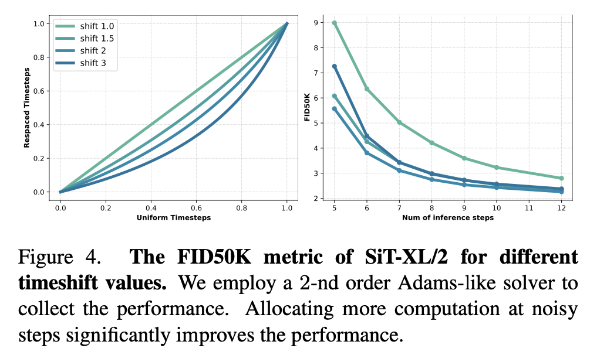

# DDT: Decoupled Diffusion Transforme

## Motivation

Current linear-based flow matching struggles to generate low-frequency details.

## Method

### Condition Encoder

Input: noisy latent $x_t$, timestep $t$, class label $y$, use AdaLN-Zero

To maintain local consistency, aligns intermediate feature $h_i$ from $i$-th layer with DINOv2 representation $r$ using
$$
\mathcal{L}_{enc}=1-\cos(r_*, h_\phi(h_i))
$$

### Decoder

To improve self-consistency, add self-conditioning $z_t$ to the decoder
$$
v_t = Decoder(x_t, t,z_t)
$$

### Sampling

Don't compute $z_t$ every sample steps, share it across multiple steps (Dynamic Programming)