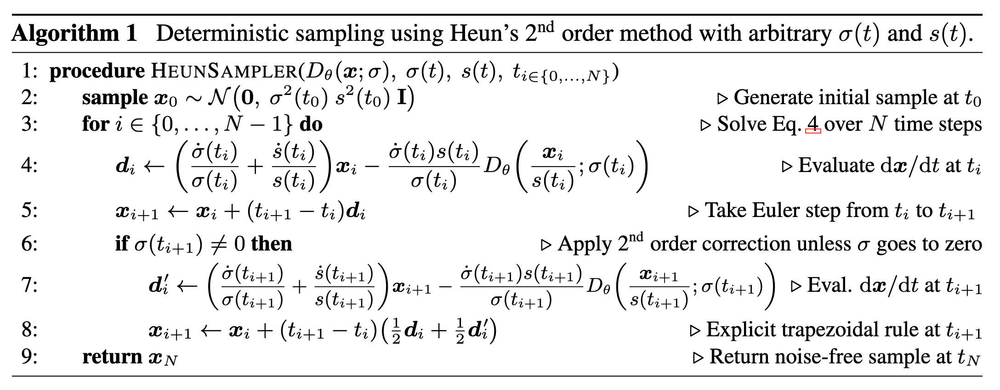
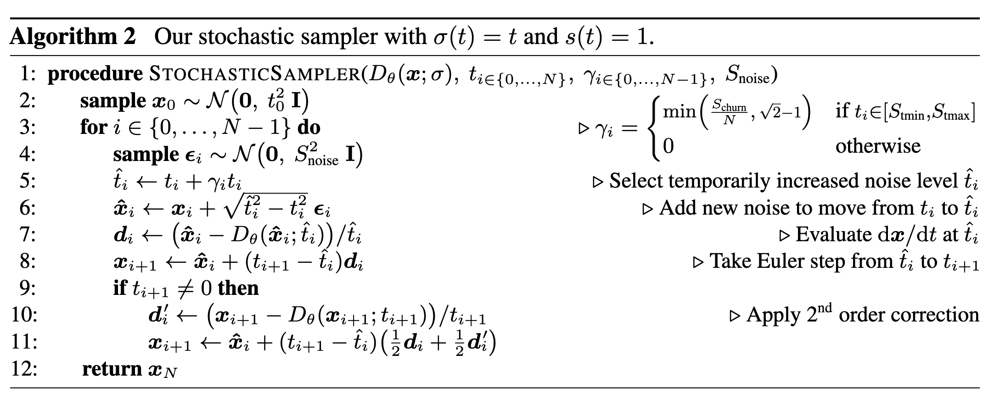

# Elucidating the Design Space of Diffusion-Based Generative Models

## Expressing diffusion models in a common framework

Denote data distribution as $p_{\text{data}}(x)$, family of mollified distributions $p(x;\sigma)$ by adding i.i.d Gaussian noise of std $\sigma$, i.e. $p(x;\sigma)=p_{\text{data}}*(\mathcal{N}(0,\sigma^2I))$

### ODE formulation:
probability flow ODE evolving a sample $x_a\sim p(x_a;\sigma(t_a))$ from time $t_a$ to $t_b$ yields a sample $x_b\sim p(x_b;\sigma(t_b))$

$$
dx=-\dot{\sigma}(t)\sigma(t)\nabla_x\log p(x;\sigma(t))dt
$$

> __Proof__: Original forward SDE: $dx=f(x,t)dt+g(t)dw_t$, if the form of $f$ is $f(x,t)=f(t)x$,, then
> $$
> dx=f(t)xdt+g(t)dw_t
> $$
> the perturbation keynels of this SDE is
> $$
> p_{0t}(x(t)|x(0))=\mathcal{N}(x(t)|s(t)x(0),s(t)^2\sigma(t)^2 I)
> $$
> where $s(t)=\exp(\int_0^t f(t')dt'), \sigma(t)=\sqrt{\int_0^t \frac{g(t')^2}{s(t')^2}dt'}$, then
> $$
> p_t(x)=\int p_{0t}(x|x_0)p_{\text{data}}(x_0)dx_0=s(t)^{-d}p(x/s(t);\sigma(t))
> $$
> the corresponding probability flow ODE is (see [SDE](./SDE.md))
> $$dx=(f(x,t)-\frac{1}{2}g^2(t)\nabla_x\log p_t(x))dt=\left[\frac{\dot{s}(t)}{s(t)}x-s(t)^2\dot{\sigma}(t)\sigma(t)\nabla_x\log p\left(\frac{x}{s(t)};\sigma(t)\right)\right]dt$$
> Under our assumption, $s(t)=1$, proof is done.

### Denoising score matching

Using denoiser $D(x;\sigma)$ minimizing the objective

$$
\mathcal{L}(\theta)=\mathbb{E}_{y\sim p_{\text{data}}(y)}\mathbb{E}_{n\sim\mathcal{N}(0,\sigma^2I)}\left[\|D(y+n;\sigma)-y\|^2\right]
$$

then the optimal denoiser satisfies

$$
\nabla_x\log p(x;\sigma)=\frac{D(x;\sigma)-x}{\sigma^2}
$$

hence

$$
dx=\left[\left(\frac{\dot{s}(t)}{s(t)}+\frac{\dot{\sigma}(t)}{\sigma(t)}\right)x-\frac{\dot{\sigma}(t)s(t)}{\sigma(t)}D\left(\frac{x}{s(t)};\sigma(t)\right)\right]dt
$$

## Sampling

### Deterministic sampling

Heun's 2nd order method for ODEs works well for deterministic sampling

How to choose $t_i=\sigma^{-1}(\sigma_i)$ and $\sigma(t)$?
- Choosing $\sigma_{i<N}=(\sigma_{\max}^{1/\rho}+\frac{i}{N-1}(\sigma_{\min}^{1/\rho}-\sigma_{\max}^{1/\rho}))^\rho$ and $\sigma_N=0$
- Best choice is $\sigma(t)=t,s(t)=1$, same as DDIM, which implies $\frac{dx}{dt}=\frac{x-D(x;t)}{t}$
- Experiment implies $\rho=7$ is best while theoretical analysis implies $\rho=3$

### Stochastic sampling

SDEs can be generalized to a sum of probability flow of ODE and time-varying Langevin diffusion

$$
dx_{\pm}=-\dot{\sigma}(t)\sigma(t)\nabla_x\log p(x;\sigma(t))dt\pm\beta(t)\sigma(t)^2\nabla_x\log p(x;\sigma(t))dt+\sqrt{2\beta(t)}\sigma(t)dw_t
$$

where $dx_+$ is forward SDE and $dx_-$ is reverse SDE. The corresponding stochastic sampler with $\sigma(t)=t,s(t)=1$ is

Use grid search to find best $S_{tmin},S_{tmax},S_{noise},S_{churn}$

## Preconditioning and training

Given a noisy image $x=y+n$ where $n\sim \mathcal{N}(0,\sigma^2I)$, its magnitude varies immensely depending on noise level $\sigma$. 
- Train a $F_\theta$ only predict $n$ scaled to unit variance, then $D_\theta(x;\sigma)=x-\sigma F_\theta(x;\sigma)$. But with large $\sigma$, $F_\theta$ may not be able to predict $n$ accurately, cause $D_\theta(x;\sigma)$ to be inaccurate.
- Use a more general notation $D_\theta(x;\sigma)=c_{skip}(\sigma)x+c_{out}(\sigma)F_\theta(c_{in}(\sigma)x;c_{noise}(\sigma))$ with loss
$$
\mathbb{E}_{\sigma,y,n}\left[\lambda(\sigma)\|D_\theta(y+n;\sigma)-y\|^2\right]=\mathbb{E}_{\sigma,y,n}\left[\lambda(\sigma)c_{out}(\sigma)^2\|F_\theta(c_{in}(\sigma)(y+n);c_{noise}(\sigma))-\frac{1}{c_{out}(\sigma)}(y-c_{skip}(\sigma)(y+n))\|^2\right]
$$

Trick:
1. set per-sample loss weight $\lambda(\sigma)c_{out}(\sigma)^2=1$
2. Choose $c_{skip}(\sigma),c_{out}(\sigma),c_{in}(\sigma)$ such that input and output of $F_\theta$ is unit variance, while minimizing $c_{out}$
3. Sample noise level $\sigma$ from a distribution $p_{train}(\sigma)$ during training, $\ln\sigma\sim\mathcal{N}(\mu,\sigma^2)$
4. Augmentation regularization: avoid overfitting, use GAN augmentation pipeline