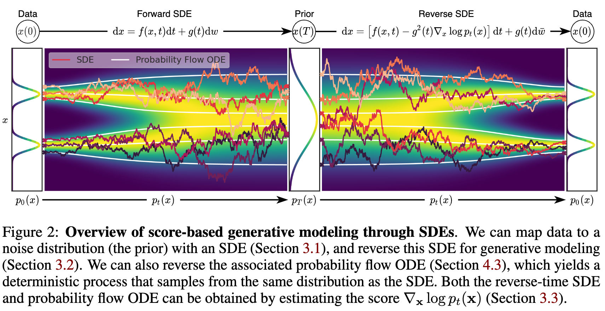
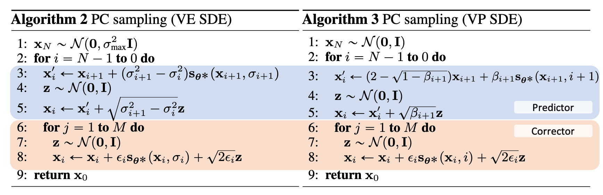

# Score-Based Generative Modeling through SDE

## Background

- NCSN:

$$
\text{Train}: \mathcal{L}(\theta)=\frac{1}{L}\sum_{i=1}^L \sigma_i^2\mathbb{E}_{x\sim p_{\text{data}}(x),\tilde{x}\sim p_{\sigma_i}(\tilde{x}|x)}\left[\|s_\theta(\tilde{x})-\nabla_{\tilde{x}}\log p_{\sigma_i}(\tilde{x}|x)\|^2\right]\\
\text{Sample}:x_t=x_{t-1}+\frac{\epsilon}{2}s_\theta(x_{t-1})+\sqrt{\epsilon}\eta_t\quad \eta_t\sim\mathcal{N}(0,I)
$$

- DDPM:

$$
\text{Train}: \nabla_\theta\|\epsilon_\theta(\sqrt{\overline{\alpha}_t}x_0+\sqrt{1-\overline{\alpha}_t}\epsilon,t)-\epsilon\|^2\quad x_0\sim q(x_0),\epsilon\sim\mathcal{N}(0,I),t\sim \text{Uni}[0,T]
\\
\text{Sample}: x_{t-1}=\mu_\theta(x_t,t)+\sigma_t z=\frac{1}{\sqrt{\alpha_t}}\left(x_t-\frac{1-\alpha_t}{\sqrt{1-\overline{\alpha}_t}}\epsilon_\theta(x_t,t)\right)+\sigma_t z\quad z\sim\mathcal{N}(0,I)
$$

If we can use a SDE to transforms data distribution to prior distribution, then we can use corresponding reverse-time SDE to transforms prior distribution to data distribution.

## Method

Diffusion process can be modeled as SDE

$$
dx=f(x,t)dt+g(t)dw
$$

where $w$ is Brownian motion, $f$ is drift coefficient of $x$, $g$ is diffusion coefficient of $x$. Define $p_t(x)$ as probability density of $x(t)$, $p_{st}(x(t)|x(s))$ is transition kernel from $x(s)$ to $x(t)$.
Discretize the SDE, we have

$$
x_{t+\Delta t}=x_t+f(x_t,t)\Delta t+g(t)\sqrt{\Delta t}\epsilon\quad \epsilon\sim\mathcal{N}(0,I)
$$

hence $p(x_{t+\Delta t}|x_t)=\mathcal{N}(x_{t+\Delta t};x_t+f(x_t,t)\Delta t,g^2(t)\Delta t)$, using Bayes' rule, we have

$$
p(x_t|x_{t+\Delta t})=\frac{p(x_{t+\Delta t}|x_t)p(x_t)}{p(x_{t+\Delta t})}\propto \exp\left(-\frac{\|x_{t+\Delta t}-x_t-f(x_t,t)\Delta t\|^2}{2g^2(t) \Delta t}+\log p(x_t)-\log p(x_{t+\Delta t})\right)\\
\approx  \exp\left(-\frac{\|x_{t+\Delta t}-x_t-f(x_t,t)\Delta t\|^2}{2g^2(t) \Delta t}-\nabla_{x_t}\log p(x_t)\cdot(x_{t+\Delta t}-x_t)-\Delta t\frac{\partial}{\partial t}\log p(x_t)\right)\\
= \exp\left(-\frac{\|x_{t+\Delta t}-x_t-\left(f(x_t,t)-g^2(t)\nabla_{x_t}\log p(x_t)\right)\Delta t\|^2}{2g^2(t) \Delta t}+O(\Delta t)\right)\\
=\exp\left(-\frac{\|x_t+\left(f(x_{t+\Delta t},t+\Delta t)-g^2(t+\Delta t)\nabla_{x_{t+\Delta t}}\log p(x_{t+\Delta t})\right)\Delta t-x_{t+\Delta t}\|^2}{2g^2(t+\Delta t) \Delta t}+O(\Delta t)\right)
$$

hence $p(x_t|x_{t+\Delta t})=\mathcal{N}\left(x_t;x_{t+\Delta t}-\left(f(x_{t+\Delta t},t+\Delta t)-g^2(t+\Delta t)\nabla_{x_{t+\Delta t}}\log p(x_{t+\Delta t})\right)\Delta t, g^2(t+\Delta t)\Delta t\right)$, which means

$$
x_{t+\Delta t}=x_t-\left(f(x_{t+\Delta t},t+\Delta t)-g^2(t+\Delta t)\nabla_{x_{t+\Delta t}}\log p(x_{t+\Delta t})\right)\Delta t+g(t+\Delta t)\sqrt{\Delta t}\epsilon\quad \epsilon\sim\mathcal{N}(0,I)
$$

so the reverse-time SDE is

$$
dx=(f(x,t)-g^2(t)\nabla_x\log p_t(x))dt+g(t)d\tilde{w}
$$

where $dt$ is negative, $d\tilde{w}$ is Brownian motion when time flows backward.

__Now, our goal is to learn $\nabla_x\log p(x,t)$__, we can use score-based generative modeling to estimate it by objective

$$
\mathcal{L}(\theta)=\mathbb{E}_{t}\left[\lambda(t)\mathbb{E}_{x(0)\sim p_{\text{data}}(x),x(t)\sim p_{0t}(x(t)|x(0))}\left[\|s_\theta(x(t),t)-\nabla_{x(t)}\log p_{0t}(x(t)|x(0))\|^2\right]\right]
$$

the optimal score network satisfies

$$
s_\theta(x(t),t)=\mathbb{E}_{x(0)\sim \frac{p_0(x(0))p_{0t}(x(t)|x(0))}{p_t(x(t))}}\left[\nabla_{x(t)}\log p_{0t}(x(t)|x(0))\right]=\nabla_{x(t)}\log p_t(x(t))
$$

which is __posterior average__ of $\nabla_{x(t)}\log p_{0t}(x(t)|x(0))$, as we claimed in DDPM.

## NCSN and DDPM are SDE models

### NCSN

When using $N$ noise scales, each perturbation kernel $p_{\sigma_i}$ of NCSN can be viewed as

$$
x_i=x_{i-1}+\sqrt{\sigma_i^2-\sigma_{i-1}^2}z_{i-1}\quad z_{i-1}\sim\mathcal{N}(0,I)\quad i=1,\cdots,N
$$

As $N\to\infty$, the corresponding SDE is

$$
dx=\sqrt{\frac{d\sigma^2}{dt}}dw
$$

when $t\to\infty$, the variance of $x$  always gives a process with exploding variance, named Variance Exploding (VE) SDE.

### DDPM

The discrete-time DDPM can be viewed as

$$
x_i=\sqrt{1-\beta_i}x_{i-1}+\sqrt{\beta_i}z_{i-1}\quad z_{i-1}\sim\mathcal{N}(0,I)\quad i=1,\cdots,N
$$

As $N\to\infty$, the corresponding SDE is

$$
dx=-\frac{1}{2}\beta(t)xdt+\sqrt{\beta(t)}dw
$$

when $t\to\infty$, the variance of $x$ always gives unit variance when initial variance is unit variance, named Variance Preserving (VP) SDE.

## Others

### Predictor-Corrector Sampling

SDE solver take one step, then use corrector like Langevin MCMC to refine the sample

### Controllable Generation

Given control signal $y$, our goal is to generate $x$ conditioned on $y$, the corresponding reverse-time SDE is

$$
dx=(f(x,t)-g^2(t)\nabla_x\log p_t(x|y))dt+g(t)d\tilde{w}\\
=(f(x,t)-g^2(t)[\nabla_x\log p_t(x)+\nabla_x\log p_t(y|x)])dt+g(t)d\tilde{w}
$$

where $\nabla_x\log p_t(x)$ is the score network, $p_t(y|x)$ is a time-dependent classifier network.