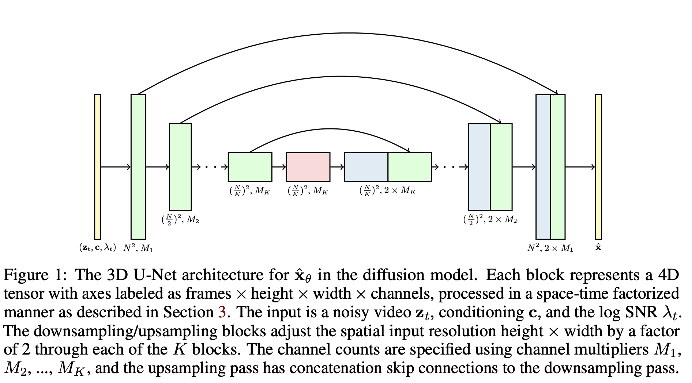

# Video Diffusion Models

## Formulation

Diffusion specified in continuous time with latents $z=\{z_t|t\in[0,1]\}$ following
$$
q(z_t|x)=\mathcal{N}(z_t;\alpha_t x,\sigma_t^2 I)\quad q(z_t|z_s)=\mathcal{N}(z_t;\frac{\alpha_t}{\alpha_s}z_s,\sigma_{t|s}^2 I)
$$
where $0\leq s<t\leq 1$ and $\sigma_{t|s}^2=\sigma_t^2(1-e^{\lambda_t-\lambda_s})$, where $\lambda_t=\log\frac{\alpha_t^2}{\sigma_t^2}$ is __log SNR__.

Train: minimize $\mathbb{E}_{\epsilon, t}\left[w(\lambda_t)||x_\theta(z_t)-x||^2\right]$
Sampling: describe forward process in reverse $q(z_s|z_t,x)=\mathcal{N}(z_s;\tilde{\mu}_{s|t}(z_t,x),\tilde{\sigma}_{s|t}^2 I)$, where
$$
\tilde{\mu}_{s|t}(z_t,x)=e^{\lambda_t-\lambda_s}\frac{\alpha_s}{\alpha_t}z_t+(1-e^{\lambda_t-\lambda_s})\alpha_s x\quad \tilde{\sigma}_{s|t}^2=\sigma_s^2(1-e^{\lambda_s-\lambda_t})
$$
we predict $x$ from $z_t$ with $x_\theta(z_t)$, so update $z_s$ by
$$
z_s=\tilde{\mu}_{s|t}(z_t,x_\theta(z_t))+\sqrt{(\tilde{\sigma^2_{s|t}})^{1-\gamma}(\sigma_{t|s}^2)^{\gamma}}\epsilon
$$
where $\epsilon\sim\mathcal{N}(0,I)$ and $\gamma\in[0,1]$.

## Method

3D U-Net: 
1. change 2D conv into 3D conv, keep attention in spatial attention mechanism
2. after spatial attention, add temporal attention
3. Use relative positional embedding to capture temporal dependency

### Reconstruction-guided sampling for improved conditional generation

We need to sample from a conditional model $p_\theta(x^b|x^a)$, two ways:
1. Train $p_\theta$ explicitly
2. Sample from a jointly trained diffusion model $p_\theta(x=[x^a,x^b])$. 
    - Sample $p_\theta(z_s|z_t)$ where $z_s=[z^a_s,z^b_s]$
    - Replace $z_s^a$ with exact samples from forward process $q(z_s^a|x^a)$ (*Replacement method*)

Replacement method doesn't work well, $x^b$ doesn't coherent with $x^a$, because we are updating $z_s^b$ using 
$$x_\theta^b(z_t)\approx\mathbb{E}_q[x^b|z_t]$$
but we want
$$
\mathbb{E}_q[x^b|z_t,x^a]=\mathbb{E}_q[x^b|z_t]+\frac{\sigma_t^2}{\alpha_t}\nabla_{z_t^b}\log q(x^a|z_t) 
$$
> Proof: $\epsilon_\theta(z_t)=-\sigma_t\nabla_{z_t}\log q(z_t)$, so
> $$
> \mathbb{E}_q[x^b|z_t]=\frac{z_t-\sigma_t\epsilon_\theta(z_t)}{\alpha_t}=\frac{z_t+\sigma_t^2\nabla_{z_t^b}\log q(z_t)}{\alpha_t}\\
> \mathbb{E}_q[x^b|z_t,x^a]=\frac{z_t-\sigma_t\epsilon_\theta(z_t|x^a)}{\alpha_t}=\frac{z_t+\sigma_t^2\nabla_{z_t^b}\log q(z_t|x^a)}{\alpha_t}
> $$
> hence
> $$
> \mathbb{E}_q[x^b|z_t,x^a]-\mathbb{E}_q[x^b|z_t]=\frac{\sigma_t^2}{\alpha_t}(\nabla_{z_t^b}\log q(z_t|x^a)-\nabla_{z_t^b}\log q(z_t))=\frac{\sigma_t^2}{\alpha_t}\nabla_{z_t^b}\log q(x^a|z_t)
> $$

we can approximate $q(x^a|z_t)=\mathcal{N}(x_\theta^a(z_t),\frac{\sigma_t^2}{\alpha_t^2}I)$, so we can predict
$$
\tilde{x}_\theta^b(z_t)=x_\theta^b(z_t)-\frac{w_r\alpha_t}{2}\nabla_{z_t^b}||x_\theta^a(z_t)-x^a||^2
$$
where $w_r$ is a hyperparameter. We call this method *reconstruction-guided sampling*.

This extends to the case of spatial interpolation. Given a low resolution videos $x^a$, we want to sample up using unconditional high resolution diffusion model $x_\theta$, our prediction is
$$
\tilde{x}_\theta(z_t)=x_\theta(z_t)-\frac{w_r\alpha_t}{2}\nabla_{z_t}||x^a(z_t)-x^a||^2
$$
