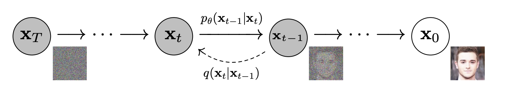
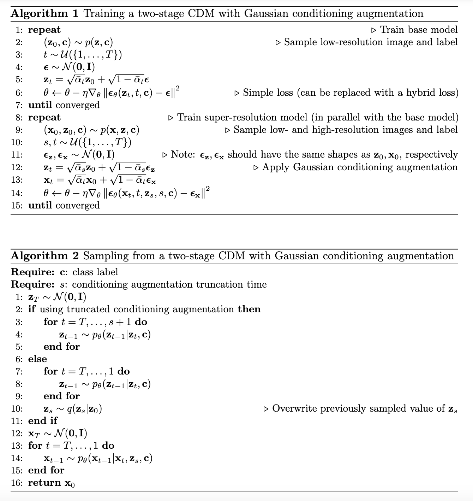

# Contents

- [DDPM](#ddpm)
- [DDIM](#ddim)
- [NCSN](#ncsn)
- [SDE Models](#sde-models)
- [Flow Matching](#flow-matching)
- [Consistency Models](#consistency-models)
- [Cold Diffusion](#cold-diffusion)
- [Other Variants](#other-variants)
    
    - [iDDPM](#iddpm)
    - [Classfier Guidance](#classifier-guidance)
    - [DiT](#dit)
    - [RePaint (Inpainting)](#inpainting-repaint)
    - [CDM (High Fidelity)](#super-resolution-cascaded-diffusion-models-cdm)
    - [Progressive Distillation](#progressive-distillation)
- [Analytic Theory](#analytic-theory)

    - [Locally Consistent Patch Mosaic Models](#locally-consistent-patch-mosaic)

# DDPM

[paper reference](https://arxiv.org/abs/2006.11239)

Idea: slowly add noise onto the image, and finally turn to pure noise; the model needs to predict the **backward process**.

- **Forward process**: $q(x_{t}|x_{t-1})$ is _hand-crafted_, written as
    $$
    q(x_t|x_{t-1})=\mathcal{N}(x_t;\sqrt{1-\beta_t}x_{t-1},\beta_t I).
    $$
    - Property: $q(x_t|x_0)=\mathcal N(x_t;\sqrt{\bar \alpha_t}x_0,(1-\bar\alpha_t)I)$, where $\bar\alpha_t=\prod_{i=1}^t (1-\beta_i)$.

- **Backward process**: $p_\theta(x_{t-1}|x_t)$ should be learned. We can parameterize as a Gaussian distribution:
    $$p_\theta(x_{t-1}|x_t)=\mathcal N(x_{t-1};\mu_\theta(x_t,t),\Sigma_\theta(x_t,t)).$$

- **Objective**: 
    $$\mathcal L_t=\mathbb E_{x_0}\mathbb E_{x_t\sim q(x_t|x_0)} D_{\text{KL}}(q(x_{t-1}|x_t,x_0)\|p_\theta(x_{t-1}|x_t)).$$
    - Property: $q(x_{t-1}|x_t,x_0)$ is a Gaussian, with
        $$\tilde \mu_t=A_tx_0+B_tx_t,$$
        $$\tilde \Sigma_t=\tilde \beta_t I,$$
        $$A_t=\dfrac{\sqrt{\bar\alpha_{t-1}}\beta_t}{1-\bar\alpha_t},\quad B_t=\dfrac{\sqrt{1-\beta_t}(1-\bar\alpha_{t-1})}{1-\bar\alpha_t},$$
        $$\tilde\beta_t=\dfrac{1-\bar\alpha_{t-1}}{1-\bar\alpha_t}\beta_t.$$
    > In fact, we are minimizing the natural "intractable" objective
    > $$\mathbb E_{x_t} D_{\text{KL}}(q(x_{t-1}|x_t)\|p_\theta(x_{t-1}|x_t)).$$
    > This is because the "average" of $q(x_{t-1}|x_t,x_0)$ given $x_t$ is $\propto q(x_{t-1}|x_t)$, and $D_{\text{KL}}$ is a [Bregman divergence](https://en.wikipedia.org/wiki/Bregman_divergence).

In DDPM, only $\mu_\theta$ is learned, and $\Sigma_\theta$ is hand-crafted as $\beta_tI$ or $\tilde\beta_t I$. (The first one is mathematically correct when $x_0\sim \mathcal N(0,I)$; the second one corresponds to delta distribution)

- **Posterior average**: theoretically, diffusion models are learning $\mathbb E x_{t-1}$ given $x_t$.
    
    - Given that $\Sigma_\theta$ is fixed, the objective
        $$\mathbb E_{x_t} D_{\text{KL}}(q(x_{t-1}|x_t)\|p_\theta(x_{t-1}|x_t))$$
        can be simplified to
        $$\mathbb E_{x_0}\mathbb E_{x_t\sim q(\cdot|x_0)} \|\tilde \mu_t(x_t,x_0)-\mu_\theta(x_t,t)\|_2^2.$$
        In practice, we train $\mu_\theta$ with
        $$\mathbb E_{\mathbf x}\|\mu_\theta(x_t,t)-x_{t-1}\|^2.$$

    - Given $x_0$ and $x_t$, $\mathbb Ex_{t-1}=A_tx_0+B_tx_t$. Thus, we can write
        $$\mathbb Ex_{t-1}=A_t\mathbb E_{x_0\sim q(\cdot|x_t)}x_0+B_tx_t.$$
        So, there are (mathematically) equivalent descriptions of the backward model:
        
        - predicting the one-step backward image average $\mathbb Ex_{t-1}$;
        - predicting the **clean image average** $\mathbb Ex_0$;
        - predicting the noise average.

The final objective may add constants for each $\mathcal L_t$, namely, $\mathcal L=\sum_{i=1}^{T} \lambda(i)\mathcal L_{i}$. The choice of $\lambda(i)$ does not matter a lot.

> We can now predict why diffusion model works: learning the global average for the first few steps, stepping forward to the subset of images for the middle steps, and learning the deblurred image for the last few steps are both easier than directly generate an image like VAE!

- **Sampling**: Since $A_t,B_t$ can be computed, using the model's prediction, we can **directly predict $\mathbb E x_{t-\tau}$ from $x_t$** where $\tau>1$, doing trade-off between quality and speed: when $\tau$ is larger, the distribution of $x_{t-\tau}$ deviates more from Gaussian!

# DDIM

[paper reference](https://arxiv.org/pdf/2010.02502)

DDIM generalizes the distribution of $x_{1:T}$ given $x_0$: we only need two things: define $q(x_t|x_0)$ (not necessarily get $x_t$ from $x_{t-1}$, i.e. can be non-Markovian); and hand-craft $q(x_{t-1}|x_t,x_0)$ so that they fit with $q(x_t|x_0)$.

Also define
$$q(x_t|x_0)=\mathcal N(x_t;\sqrt{\bar\alpha_t}x_0,(1-\bar\alpha_t)I).$$
Then, we can define
$$q(x_{t-1}|x_t,x_0)=\mathcal{N}\left(\sqrt{\bar{\alpha}_{t-1}}x_{0}+\sqrt{1-\bar{\alpha}_{t-1}-\sigma_t^2}\frac{x_t-\sqrt{\bar{\alpha}_t}x_0}{\sqrt{1-\bar{\alpha}_t}},\sigma_t^2 I\right),$$
where $0\le \sigma_t^2\le 1-\bar\alpha_{t-1}$ is **arbitrary**. For a fixed $\sigma=\{\sigma_t\}$, call this distribution $q_\sigma$.

> We say DDIM is a generalized version of DDPM, since if we set $\sigma_t=\sqrt{\frac{1-\bar{\alpha}_{t-1}}{1-\bar{\alpha}_{t}}\beta_t}$ in DDIM, the backward process is as same as DDPM.

> Now, $q(x_t|x_{t-1},x_0)$ is still Gaussian by Bayes' rule; however, $q(x_t|x_{t-1})$ is (generally) not!

- Given $x_t$, the model first predict $x_0$ using $f_\theta(x_t,t)$, and then sample $x_{t-1}\sim q_\sigma(x_{t-1}|x_t,x_0=f_\theta(x_t,t))$.
    
    - Parameterize as predicting noise:
    $$f_\theta(x_t,t)=\frac{x_t-\sqrt{1-\bar{\alpha}_t}\epsilon_\theta(x_t,t)}{\sqrt{\bar{\alpha}_t}}.$$

- **Objective** $\mathcal J$: variational lower bound:
$$\mathbb E_{x_0\sim q} [\log p_\theta(x_0)]\le \mathbb E_{x_{0:T}\sim q_\sigma} [\log p_\theta(x_{0:T})-\log q_\sigma(x_{1:T}|x_0)]=:\mathcal J_\sigma.$$
- **Objective** $\mathcal L$: predict the noise with loss weights $\gamma$:
$$\sum_{t=1}^T \gamma_t\mathbb E_{x_0\sim q,\epsilon\sim \mathcal N(0,I),x_t=\sqrt{\bar \alpha_t}x_0+\sqrt{1-\bar\alpha_t}\epsilon} \|\epsilon-\epsilon_\theta(x_t,t)\|^2.$$

- **THEOREM**. For each $\sigma$, let $\gamma_t=\dfrac{1-\bar\alpha_t}{2\bar\alpha_t\sigma_t^2}$, we have $\mathcal J_\sigma=\mathcal L_\gamma+C_\sigma$, where $C_\sigma$ is a constant.

> One implication: if $\epsilon_\theta(\cdot,t)$ use independent parameters across $t$, the optimal solution of $\mathcal L_\gamma$ is independent of $\gamma$. Thus, we can first train a DDIM, then choose $\sigma$ to do inference!

### Accelerating Inference

During sampling, we can just choose a sequence $\tau_1<\cdots<\tau_s=T$, and sample in the following order: $x_{\tau_s}\to x_{\tau_{s-1}}\to \cdots\to x_0$. To match the prior, we define
$$q(x_{\tau_{i-1}}|x_{\tau_i},x_0)=\mathcal N(\sqrt{\bar \alpha_{\tau_{i-1}}} x_0+\sqrt{1-\bar\alpha_{\tau_{i-1}}-\sigma^2_{\tau_{i}}} \dfrac{x_{\tau_i}-\sqrt{\bar \alpha_{\tau_i}}x_0}{\sqrt{1-\bar\alpha_{\tau_i}}},\sigma_{\tau_i}^2I).$$
Essentially, we train the model in a larger set of timesteps (predicting $x_0$), but only choose a subset for inference. The subset size $s$ trades-off between quality and speed.

> Inspiration: we can train the model on the continuous timestep $(0,1]$ by defining a continuous forward process! In this way we may achieve better generalizability. This leads to the SDE models.

# NCSN

[paper reference](https://arxiv.org/pdf/1907.05600v3)

Idea: learn the **score function** $s(x)$ for the data distribution $p_{\text{data}}(x)$, defined as
$$s(x)=\nabla_x \log p_{\text{data}}(x).$$
> Motivation: Once $s$ is learned, we can sample using **Langevin Dynamics**.

- **Sampling**: $x_t\leftarrow x_t+\dfrac{\varepsilon}{2}\nabla_x \log p(x)+\sqrt{\varepsilon}z_t$, where $z_t\sim \mathcal N(0,I)$.

- **Objective**: Fisher divergence
    $$\dfrac{1}{2}\mathbb E_{x\sim p_{\text{data}}} \|s_\theta(x)-\nabla_x \log p_{\text{data}}(x)\|_2^2.$$
    To make it tractable, we can prove the following is the equivalent loss function:
    $$\mathbb E_{x\sim p_{\text{data}}}[\dfrac{1}{2}\|s_\theta(x)\|^2+\text{tr}(\nabla_x s_\theta(x))].$$

> There are some limitations of this model:    
> 1. About the objective: we need to compute grad of grad during training.
> 2. About the score function $\nabla_x \log p_{\text{data}}(x)$: $p_{\text{data}}$ is low-dimensional, making (1) this grad not defined; (2) the change of $s$ at low-density area extremely low, hindering the learnability.
> 3. About the distribution: let $p(x)=\tau p_1(x)+(1-\tau)p_2(x)$ be the mixture of $p_1$ and $p_2$, satisfying $p_1$ and $p_2$ do not overlap. Then, at the area of $p_i$ ($i=1,2$),
>       $$\log p(x)=C_i+\log p_i(x),$$
>       meaning that the score function $s$ is independent of $\tau$, which is absurd.
>
> The solution for all the limitations is: **add noise to the data distribution**.

Define a new distribution $p'(x')$: $x'=x+\sigma z$, where $x\sim p_\text{data}$ and $z\sim \mathcal N(0,I)$.

- **Objective**: Fisher divergence on $p'$:
    $$\dfrac{1}{2}\mathbb E_{x'\sim p'} \|s_\theta(x')-\nabla_x \log p'(x')\|_2^2.$$
    We can prove it is equivalent to
    $$\dfrac{1}{2}\mathbb E_{x\sim p_{\text{data}}} \mathbb E_{x'\sim p'(\cdot|x)} \|s_\theta(x')-\nabla_x \log p'(x'|x)\|_2^2.$$
    This is tractable since $p'(\cdot|x)$ is hand-crafted. 
    - When $x'=x+\sigma z$ ($z\sim \mathcal N(0,I)$), we have
        $$
        \nabla_x \log p'(x'|x)=\dfrac{x-x'}{\sigma^2}.
        $$
    > Here we have a trade-off of $\sigma$: smaller $\sigma$ leads to better quality, but higher variance for score function learning (so harder training).

- **Annealed Gaussian perturbation**: learn the score function of different noise magnitudes $\sigma_1>\sigma_2>\cdots>\sigma_L$. Combine them into one model $s_\theta(x,\sigma_i)$ (**noise conditional score network, NCSN**). The objective is
    $$\dfrac{1}{L}\sum_{i=1}^L \lambda(\sigma_i)\mathbb E_{x\sim p_\text{data},z\sim \mathcal N(0,I)} \|s_\theta(x+\sigma_iz,\sigma_i)+\dfrac{z}{\sigma_i}\|_2^2.$$
    Intuitively, in order to keep the same variance, we set $\lambda(\sigma_i)\propto \sigma_i^2$. Defining $\epsilon_\theta(\cdot,\sigma_i)=\sigma_is_\theta(\cdot,\sigma_i)$, the objective becomes
    $$\dfrac{1}{L}\sum_{i=1}^L \mathbb E_{x\sim p_\text{data},z\sim \mathcal N(0,I)} \|\epsilon_\theta(x+\sigma_iz,\sigma_i)-z\|_2^2.$$

> We left the choice of $\sigma_1>\sigma_2>\cdots>\sigma_L$. Intuitively, $\sigma_1$ should be sufficiently large and $\sigma_L$ should be sufficiently small; the process of denoising $\sigma_i\to \sigma_{i-1}$ in each round should have same difficulty. Thus, we may set
> $$\dfrac{\sigma_1}{\sigma_2}=\dfrac{\sigma_2}{\sigma_3}=\cdots=\dfrac{\sigma_{L-1}}{\sigma_L}.$$ 

- **Sampling**: **Annealed Langevin Dynamics**. Do sampling at noise level $\sigma_1,\sigma_2,\cdots,\sigma_L$ sequentially, each with $T$ steps. The step size of Langevin Dynamics $\alpha_i\propto \sigma_i^2$.

> Intuition for $\alpha_i\propto \sigma_i^2$: consider the data being delta distribution. We want the model to do "similar" step at each noise level, i.e. the length of a step should $\propto \sigma_i$. However, the score function $\propto \sigma_i^{-1}$ in the similar position; so we need the step size $\propto \sigma_i^2$.

# SDE Models

[paper reference](https://arxiv.org/pdf/2011.13456)

Idea: hand-craft forward process as
$$dx=f(x,t)dt+g(t)dw,$$
where $dw$ means the Brownian process. (_This is equivalent to_: $p(x_{t+\Delta t}|x_t)=\mathcal N(x_t+f(x,t)\Delta t,(g(t)^2\Delta t)\cdot I)$.)

Mathematics derivation shows that the backward process should be
$$dx=(f(x,t)-g(t)^2\nabla_x \log p_t(x))dt+g(t)dw,$$
which is learned. Essentially, we only need to learn $\nabla_x\log p_t(x)$.

- **Objective**: for $t\in (0,1)$,
    $$\mathbb E_{x_t\sim p_t} \|s_\theta(x_t,t)-\nabla_x \log p_t(x_t)\|_2^2.$$
    To make it tractable, we should condition on $x_0$:
    $$\mathcal L_t=\mathbb E_{x_0;x_t\sim p_t(\cdot|x_0)} \|s_\theta(x_t,t)-\nabla_x\log p_t(x_t|x_0)\|_2^2.$$
    > This is mathematically correct, since
    > $$\mathbb E_{x_0\sim p(x_0|x_t)} \nabla_x \log p_t(x_t|x_0)=\nabla_x\log p_t(x_t).$$

### SDE model as continuous NCSN

Setting $f=0$, we have $p_t(x_t|x_0)$ is a Gaussian centered at $x_0$ for each $t$, aligning with the design of NCSN. We have
$$\nabla_x \log p_t(x_t|x_0)\propto x_t-x_0,$$
so the model is learning the ground-truth $x_0$.

> When $f=0$, the variance will explode when $t\to \infty$. We call it **Variance Exploding (VE) SDE**.

### SDE models as continuous DDPM

We can sample $x_t$ with $\alpha(t)x_0+\beta(t)z$ in DDPM, where $z\sim \mathcal N(0,I)$, $\alpha^2+\beta^2=1$. Thus, the SDE can be defined as
$$dx=\dfrac{\alpha'(t)}{\alpha(t)}xdt+\sqrt{2\beta\left(\beta'(t)-\frac{\beta(t)\alpha'(t)}{\alpha(t)}\right)}dw.$$

> When the SDE is of the form $dx=-\dfrac{\tau(t)}{2}xdt+\sqrt{\tau(t)}dw$, the variance is preserved (when the initial variance is $1$). This is **Variance Preserving (VP) SDE**.

### Fokker-Planck equation and ODE models

Given forward process $dx=f(x,t)dt+g(t)dw$, we have F-P equation
$$\boxed{\dfrac{\partial p_t(x)}{\partial t}=-\nabla\cdot (f(x,t)p_t(x))+\dfrac{g^2(t)}{2}\nabla^2p_t(x).}$$
We can write
$$\dfrac{\partial p_t(x)}{\partial t}=-\nabla\cdot \left(\left(f(x,t)-\dfrac{g^2(t)}{2}\nabla_x \log p_t(x)\right)\cdot p_t(x)\right).$$
Thus, if we define the process as
$$dx=\left(f(x,t)-\dfrac{g^2(t)}{2}\nabla_x \log p_t(x)\right)dt,$$
it still fits the marginals $p_t(x)$!

> Benefits for this ODE in score-based models:    
> - **Efficient Sampling**: when sampling, simulating ODE can lead to better trade-off between NFE (number of sample steps) and quality.    
> - **Interpolation**: as we get a mapping between latent and truth, we can do interpolations between latent points and get "hybrid" images.
> - **Likelihood calculation**: For an ODE $dx=F(x,t)dt$, we can compute
>   $$\log p_0(x(0))=\log p_T(x(T))+\int_0^T \nabla\cdot F(x(t),t)dt.$$

This means that, we can just hand-craft the ODE coefficient
$$u_t(x|x_0)=f(x,t)-\dfrac{g^2(t)}{2}\nabla_x \log p_t(x|x_0),$$
and learn the backward process by defining the objective
$$\mathcal L_t=\mathbb E_{x_0}\mathbb E_{x_t\sim p_t(\cdot|x_0)} \|v_\theta(x_t,t)-u_t(x_t|x_0)\|_2^2.$$
When sampling, we pick $x_1\sim p_1(x_1)$ and use $dx=v_\theta(x_t,t)dt$ to solve the ODE back to $t=0$. Thus, the hand-crafted $u_t$ must have a great marginal $p_1$.

> The new _deterministic_ ODE process tells us that $f,g$ in SDE models are redundant, since we only care about the **marginals** $p_t(x_t|x_0)$.    
> Comparing with SDE models, we only need to design one $u_t$ instead of $f,g$; the sampling is faster (ODE solvers are quicker than SDE solvers!)

# Flow Matching

Recall the ODE models objective
$$\mathcal L_t=\mathbb E_{x_0}\mathbb E_{x_t\sim p_t(\cdot|x_0)} \|v_\theta(x_t,t)-u_t(x_t|x_0)\|_2^2,$$
where $t\in (0,1)$. 

Idea: Since $u_t$ is hand-crafted, we can write using **interpolants**. Given $x_0\sim p_0(x_0)$ and $x_1\sim p(x_1|x_0)$, the interpolant $I_t(x_0,x_1)$ is the position at time $t$ when starting from $x_0$ and finally reaching $x_1$.

- **Objective**:
$$\mathcal L_t=\mathbb E_{x_0\sim p_0;x_1\sim p(\cdot|x_0)} \|v_\theta(I_t(x_0,x_1),t)-\dfrac{\partial}{\partial t}I_t(x_0,x_1)\|_2^2.$$

- Example (Linear interpolation): $I_t(x_0,x_1)=tx_1+(1-t)x_0$, $p_0$ is data distribution and $p(x_1|x_0)=\mathcal N(0,I)$.

> **Note**: Here, $x_0,x_1$ are symmetric, so it is not necessary that $p_1(x_1)$ is an easy distribution. We are actually learning a mapping between arbitrary $p_0$ and $p_1$!

- **Optimal Transport (OT)**: $I_t(x_0,x_1)=tx_1+(1-t)x_0$.

- **Problem**: How do we define $x_1\sim p_1(\cdot|x_0)$?
- Solution (**Rectified flow**): First we train the model with $p$ being a simple distribution independent of $x_0$ (e.g., $\mathcal N(0,I)$). When the model is trained, we get a mapping from each $x_0\sim p_0$ to $x_1\sim p_1$, call it $f$. Then, we obtain a new distribution $p_1'(x_1|x_0)=\delta(x_1-f(x_0))$. We train again with $p_1'$, and so on. This process is called **reflow**.

> Intuitively, during one round of reflow, each path from $p_0$ to $p_1$ will be more straight. Assuming infinitely fitting, finally we get a direct mapping, where lines do not intersect. In this way, we only need _one step_ to generate!

# Consistency Models

[paper reference](https://arxiv.org/pdf/2303.01469)

TODO: [CONSISTENCY MODELS MADE EASY](https://arxiv.org/pdf/2406.14548) and [IMPROVED TECHNIQUES FOR TRAINING
CONSISTENCY MODELS](https://arxiv.org/pdf/2310.14189v1).

Idea: Given a learned ODE $dx=v_\theta(x,t)dt$, we want to directly learn the solution from $x_t$ ($0<t\le 1$): $\psi_\theta(x_t,t)$.

- **Consistency Distillation (CD) loss**: the solution $\psi_\theta(x,t)$ must satisfy
    $$\psi_\theta(x+v(x,t)\Delta t,t+\Delta t)=\psi_\theta(x,t).$$
    Thus, we define the loss as
    $$\mathcal L_t=\mathbb E_{x\sim p_t} D(\psi_\theta(x+v(x,t)\Delta t,t+\Delta t),\psi_\theta(x,t)),$$
    where $D$ is a measurement, such as $\ell_1$, $\ell_2$ squared, or even LPIPS (semantic distance), etc.

- Problem: There is no _boundary conditions_! The best solution is just constant.
- Solution: **skip connection parameterization**. Let $\psi(x,t)=c_{\text{skip}}(t)x+c_{\text{out}}(t)f_\theta(x,t)$, where $c_{\text{skip}},c_{\text{out}}$ are hand-crafted functions satisfying $c_{\text{skip}}(0)=1-c_{\text{out}}(0)=1$.

> After learning such $\psi$, we can (theoretically) do one-step generation: just output $\psi_\theta(x_1,1)$.     
> However, since the ODE $v_\theta$ is also learned from the conditional ODE from each $x_0$, and $\psi_\theta$ is learned from $v_\theta$, the error will accumulate.

Idea: Learn from the ground-truth ODE $v(x,t)$ instead of $v_\theta(x,t)$, i.e. learn the ODE solver end-to-end.

- **Consistency Training (CT)**: change the loss to
    $$\mathcal L_t=\mathbb E_{x_0\sim p_0} \mathbb E_{x\sim p_t(\cdot|x_0)} D(\psi_\theta(x+\color{red}{u_t(x|x_0)}\color{none}\Delta t,t+\Delta t),\psi_\theta(x,t)).$$

When training, $\Delta t=T/N$, where $N$ is the **step schedule**. It should gradually **increase** during training (since smaller $N$ has lower variance, larger $N$ has lower bias).

<!-- > Q: Why this loss is a reasonable alternative of
> $$\bar{\mathcal{L}}_t=\mathbb E_{x\sim p_t} D(\psi_\theta(x+v(x,t)\Delta t,t+\Delta t),\psi_\theta(x,t))?$$
> A: First we know that $v(x,t)=\mathbb E_{x_0\sim p(x_0|x_t)} u_t(x_t|x_0)$. So, theoretically, $|\mathcal L_t-\bar{\mathcal{L}}_t|=O(\Delta t^2)$. -->

- **Multistep Sampling**: sample by one step $\psi(x_1,1)$ may obtain low quality samples. We can do the following:

    - Suppose we have $x_t$. First, get $\psi(x_t,t)=:x'_0$, and use $x'_0$ to simulate SDE, getting $x_{t-\tau}$. Use it as the truth of the next step.

- Discrete example: when $x_t=x+f(t)\mathcal N(0,I)$. The algorithm is as follows. Note that we use a special EMA here. During multistep sampling, we first sample $x_1=x+f(1)\epsilon$; predict the original point $\psi_\theta(x_1,1)=:x'_0$; and obtain $x'_t=x'_0+f(t)\epsilon'$, where $t<1$ is the next prediction step, and so on.

> The original paper claims that, _only using one-step generation_ can achieve great performance! It also searches the best $t$ during two-step generation, achieving even better results.

# Cold Diffusion

[paper reference](https://arxiv.org/pdf/2208.09392)

Idea: essentially, the diffusion model is based on a forward process $x_t\sim D(x_0,t)$; the model needs to predict the recovering process $R_\theta(x_t,t)\approx x_0$ from $x_t$. Thus, $D$ may not be based on Gaussian noise, but can be other disturbing process or even **deterministic** evolution. 

For randomized $D$, according to DDIM, we hand-craft $D$ s.t. $q(x_T)$ and $q(x_{t-1}|x_t,x_0)$ are all simple. During sampling, we start from choosing a random $x_T$; in each step, predict $x_0\approx x_0'$ using trained $R_\theta$ in each step, and sample $x_{t-1}\sim q(\cdot|x_t,x_0')$. The training objective is:
$$\mathcal L_t=\mathbb E_{x_0;z\sim D(x_0,t)} \|x_0-R(z,t)\|^2.$$

Key idea: generalize to **determinisitc** case. ($D(x_0,t)=x_t$, but not a distribution)

- **Objective**:
$$\mathcal L_t =\mathbb E_{x_0} \|x_0-R_\theta(D(x_0,t),t)\|^2.$$

> When training, **adding noise** to $x_0$ may improve performance:
> $$\mathcal L_t=\mathbb E_{x_0;z\sim \mathcal N(0,I)} \|x_0-R_\theta(D(x_0+\sigma z,t),t)\|^2.$$

- **Sampling**: From $x_t$ to $x_{t-1}$, we sample according to the following formula:
    $$x_{t-1}=x_t-D(R(x_t,t),t)+D(R(x_t,t),t-1).$$

> The naive sampling method is one-step sampling: $x_0=R(x_t,t)$; but this often gets blurry images.
> 
> The simplest multistep generation is $x_{t-1}=D(R(x_t,t),t-1)$; but the error will still accumulate since $D$ is deterministic, which means that a slight error may lead to a completely different trajectory.
>
> The adopted sampling method uses the term $(x_t-D(R(x_t,t),t))$ to diminish the error by eliminating the $x$-term in the Taylor expansion of $D(x,t)$. 

# Other Variants

## iDDPM

[paper reference](https://arxiv.org/pdf/2102.09672): Improved Denoising Diffusion Probabilistic Models.

- Improvement 1: Learn $\Sigma_\theta(x_t,t)$.

    - DDPM just set $\Sigma_\theta(\cdot,t)=\beta_tI$ or $\tilde \beta_t I$, corresponds to the data distribution to be isotropic Gaussian or delta function.
    - Let $\Sigma_\theta(x_t,t)=\exp\{v_\theta(x_t,t) \log \beta_t+(1-v_\theta(x_t,t))\log \tilde \beta_t\}I$ (interpolation between $\beta_t,\tilde \beta_t$ in $\log$ domain).
    - If $\Sigma_\theta$ is fixed, the VLB is equivalent to
        $$\mathcal L_{\text{simple}}:=\mathbb E_{t,x_t} \gamma_t\|\epsilon_\theta(x_t,t)-\epsilon\|_2^2.$$
        The $\gamma_t$ is set to $1$ in DDPM. To learn $\Sigma_\theta$, we have the VLB loss
        $$\mathcal L_{\text{VLB}}:=\sum_{t=0}^{T-1}\mathbb E_{\mathbf x} D_{\text{KL}}(q(x_{t-1}|x_t,x_0)\|p_\theta(x_{t-1},x_t)).$$
        > $q(x_{t-1}|x_t,x_0)$ and $p_\theta(x_{t-1},x_t)$ are all Gaussians. The KL divergence of two Gaussians has a closed form.
    - **Objective**: $\mathcal L_{\text{simple}}+\lambda \mathcal L_{\text{VLB}}$, where $\lambda=10^{-3}$. In $\mathcal L_{\text{VLB}}$, **$\mu_\theta$ stops gradient**.

- Improvement 2: The schedule of $\bar \alpha_t$.
    
    
    - The "linear schedule" in DDPM makes the learning too easy at larger $t$ (the noise level quickly grows).
    - **Cosine schedule**: $\bar\alpha_t=f(t)/f(0)$, where
        $$f(t)=\cos^2\left(\dfrac{\pi}{2}\cdot\dfrac{t/T+s}{1+s}\right),$$
        $s$ is the offset preventing $\beta_t$ to become too small when $t\to 0$.
        > Introducing initial noise will improve training!

## Classifier Guidance

For score-based models or SDE models, the model is learning $\nabla_x \log p_t(x)$. For **conditioned** generation, we need $p_t(x|y)\propto p_t(y|x)p_t(x)$. Thus,
$$\nabla_x \log p_t(x|y)=\nabla_x \log p_t(x)+\nabla_x \log p_t(y|x).$$
The first term is learned by the initial model; $p_t(y|x)=p(y|x)$ can be modeled as a differentiable **classifier**. 

For Gaussian noise process, $\epsilon_\theta(x_t,t)=-\sigma_t \nabla_x \log p_t(x_t)$. Using **classifier guidance**, we have
$$\epsilon_\theta(x_t,y,t)=\epsilon_\theta(x_t,t)-\sigma_t\nabla_x \log p(y|x_t).$$

- **Temperature**: add an **inverse temperature** $\gamma$:
    $$\nabla_x \log p_t(x)+\gamma\nabla_x \log p(y|x),$$
    corresponding to the epsilon estimation
    $$\epsilon_\theta(x_t,y,t)=\epsilon_\theta(x_t,t)-\sigma_t\gamma\nabla_x \log p(y|x_t).$$
    > When $\gamma$ is larger, the sampling process will more concentrate on larger $p(y|x)$.

- **Classifier-Free Guidance (CFG)**. Train the model on semi-supervised dataset $(x,y)$ and $(x,\text{None})$, allowing the model to learn $\nabla_x \log p_t(x|y)$ and $\nabla_x \log p_t(x)$.

    - **Sampling**: estimate
        $$\nabla_x \log p_\gamma(x|y) = (1-\gamma) \nabla_x \log p(x) + \gamma \nabla_x \log p(x|y),$$
        corresponding to
        $$\epsilon_\theta(x_t, y, t, \gamma) = \epsilon_\theta(x_t, t) + \gamma (\epsilon_\theta(x_t, y, t) - \epsilon_\theta(x_t, t)).$$
        We can write
        $$\epsilon_{\text{CFG}}=\epsilon_{\text{uncond}}+\gamma\cdot(\epsilon_{\text{cond}}-\epsilon_{\text{uncond}}).$$
    > In [this paper](https://arxiv.org/abs/2207.12598), $\gamma=1.3$ is the best.    
    > Mathematically, CFG is equivalent to classifier guidance with the same $\gamma$.

## DiT

[paper reference](https://arxiv.org/pdf/2212.09748)

Idea: Use **Transformer** as the **backbone model** (noise prediction model) of diffusion models.

- **Latent Diffusion Model (LDM)**: for an image of size $256\times 256\times 3$, use a VAE to encode into the latent space of size $32\times 32\times 4$. The paper adopts the VAE pretrained by Stable Diffusion.

- **ViT**: patchify the latent into $p\times p$ patches ($p=2$ works the best), flatten into sequence, and feed into Transformer.

- **Condition** (on label $y$ and timestep $t$).

    - **adaLN-Zero**: Use AdaLN (learn $\gamma,\beta$ from the embedding of $y,t$). Also learn a **scale factor** $\alpha$ for each dimension, **initialized to $0$**.
    > In this way, each residual block is initialized into identity block, enabling deeper network.

- **Decode**: Suppose the sequence size is $p\times p\times C$ for Transformer. The output will go through a linear layer and obtain a sequence $p\times p\times 2C$, serving as the latent of predicted _noise_ and _covariance matrix_.

## Inpainting: RePaint

[paper reference](https://arxiv.org/pdf/2201.09865)

Idea: Do "Guided" backward process to **control the masked pixels**.

<!-- - **Forward process** ($x_{t-1}\to x_t$): $x_t\sim \mathcal N(x_t;\sqrt{1-\beta_{t-1}}x_{t-1},\beta_{t-1}I)$. -->
- **Backward process** ($x_t\to x_{t-1}$):
    $$x_{t-1}^{\text{unknown}}\sim \mathcal N(\mu_\theta(x_t,t),\Sigma_\theta(x_t,t));$$
    $$x_{t-1}^{\text{known}}\sim \mathcal N(\sqrt{\bar\alpha_t}x_0^{\text{masked}},(1-\bar\alpha_t)I);$$
    $$x_{t-1}=m\odot x_{t-1}^{\text{known}}+(1-m)\odot x_{t-1}^{\text{unknown}}.$$
    > We control the masked pixels to match the current noise level $\bar\alpha_t$. However, solely doing this process will lead to bad performance. _One can show that it is not mathematically correct._    
    > The process does not correlate $x_{t-1}^{\text{known}}$ and $x_{t-1}^{\text{unknown}}$, so the masked and unmasked part will be separated.    
    > To solve that, we must do _several_ $x_t\to x_{t-1}$ steps, making the unmasked part more and more _resonate_ with the masked part.

- **Sampling**. For each $t$, do $x_t\to x_{t-1}$ (backward) and $x_{t-1}\to x_t$ (standard forward process (i.e., add noise)) multiple times (hyperparameter $N$: repeat steps). The final $x_{t-1}$ is used for further sampling.

    - We can even use larger **jump length** $j>1$: repeat $N$ times the following: $x_t\to x_{t-1}\to \cdots\to x_{t-j}$ and $x_{t-j}\to\cdots\to x_t$.
    > Observation: Larger $j$ makes two parts less correlated, enabling bolder sampling (e.g., adding a new object); smaller $j$ leads to timid sample, often just matching the surrounding textures.
    

## Super Resolution: Cascaded Diffusion Models (CDM)

[paper reference](https://arxiv.org/pdf/2106.15282)

Idea: Learn a _super-resolution diffusion model_ $z\to x$: $\epsilon_\theta(z_t,t,x_s,s,y)\approx \epsilon_x$. During training, $s,t\sim \mathcal U$; during sampling, we use a fixed $s_0>0$ to guide $z$: $x_{t-1}\sim p_\theta(x_{t-1}|x_t,z_{s_0},y)$.

> Reason for choosing $s_0$: since $z_{s_0}$ is augmented by a small noise at training, the model is stronger at $s=s_0$ comparing with $s=0$.

- Generating **high fidelity image**: train a hierarchical model chain. For instance: $32\times 32\to 64\times 64\to 128\times 128\to \cdots$. The first model is the standard diffusion model; others are _super-resolution_ models.

## Progressive Distillation

[paper reference](https://arxiv.org/pdf/2202.00512)

Idea: Distill a trained diffusion model of large $T$, by halving the sampling step in each distillation step. Use a student model $\theta$ to fit the teacher model $\eta$: for two consecutive steps $t\to t'\to t''$, let $x_\theta$ fit $\tilde x_\eta$ (the equivalent predicted $x_0$ for $x_t\to x_{t''}$).

# Analytic Theory

## Locally Consistent Patch Mosaic Models

[paper reference](https://arxiv.org/pdf/2412.20292)

> Theoretically, assuming infinite fitting, the diffusion model will only output the dataset images, without any creativity. Thus, the creativity comes from _insufficient learning_. What is the **inductive bias** of diffusion models that make the **creativity** emerges?

Idea: the convolutional networks (e.g., UNet) have inductive bias on **spatial equivariance** and **locality**.

- The perfect score function:
    $$s_\theta(x,t)=\sum_{x_0\in \mathcal D} \dfrac{\sqrt{\bar\alpha_t}x_0-x}{1-\bar\alpha_t}\cdot W_t(x_0|x),$$
    where
    $$W_t(x_0|x)= \dfrac{\mathcal N(x;\sqrt{\bar\alpha_t}x_0,(1-\bar\alpha_t)I)}{\sum_{x_0'\in \mathcal D} \mathcal N(x;\sqrt{\bar\alpha_t}x_0',(1-\bar\alpha_t)I)}.$$

- **Locality**: for the model $s_\theta$ and a pixel $p$, it has a limited reception field $\Omega_p$. Thus, the score function $s_\theta(x,t)_p$ should only depend on $x_{\Omega_p}$.

    - Adding this, the best $s_\theta$ will be

        $$s_\theta(x,t)_p=\sum_{x_0\in \mathcal D} \dfrac{\sqrt{\bar\alpha_t}(x_0)_p-x_p}{1-\bar\alpha_t}\cdot W_t((x_0)_{\Omega_p}|x_{\Omega_p}).$$

- **Equivariance**: For CNNs, assume each reception field $\Omega_p$ has same size $P\times P$ centered at $p$. Since CNN forces each kernel shares the parameters, **we should consider all patches appeared in the dataset at every position**. 
    
    - All patches appeared in the dataset is denoted as $\mathcal P_\Omega(\mathcal D)$. The best $s_\theta$ will be
        $$s_\theta(x,t)_p=\sum_{P_0\in \mathcal P_\Omega(\mathcal D)} \dfrac{\sqrt{\bar\alpha_t} P_0(0)-x_p}{1-\bar\alpha_t} \cdot W_t(P_0|x_{\Omega_p}).$$
    - This is the **equivariant local score (ELS) machine**.
    > Essentially, the network learns the **patch patterns**. It will generate images that are locally reasonable. This can explain why **spatial inconsistencies** happen.    
    > For instance, when generating a hand, if the reception field is small, the model needs to decide independently whether a place is going to generate a finger, causing different number of fingers.

- **Thm**. Using the ELS machine as the score function, the model will converge on an image that: for each pixel $p$ and corresponding $x_{\Omega_p}$, there exists $P\in \mathcal P_\Omega(\mathcal D)$ s.t. $x_p=P(0)$ and
    $$P=\arg\min_{P'\in \mathcal P_\Omega(\mathcal D)} \|P'-x_{\Omega_p}\|_2^2.$$
    Proof: the model should converge on a stationary point. $\Box$

For instance, if the dataset only contains two images (pure black and white), the model will generate exponentially many images (they are all stationary points). This explains the creativity!

- Detail 1: when $0<t<T$ is varying, the reception field is also varying. Measured by the absolute values of $\nabla_x s_\theta(x,t)$ at each pixel.

- Detail 2 (**Breaking equivariance through boundaries**): When doing padding in CNNs, the model can discriminate whether a patch is in the middle, edge, or corner. So the ELS machine should be modified that a patch should only consider dataset patches that have the same zero padding.

- Observation (how **attention** breaks locality): when adding attention modules, the model output and the theory output are mostly **semantically
coherent**; but the model output _smoothes the
background and separates it from the foreground object_.

