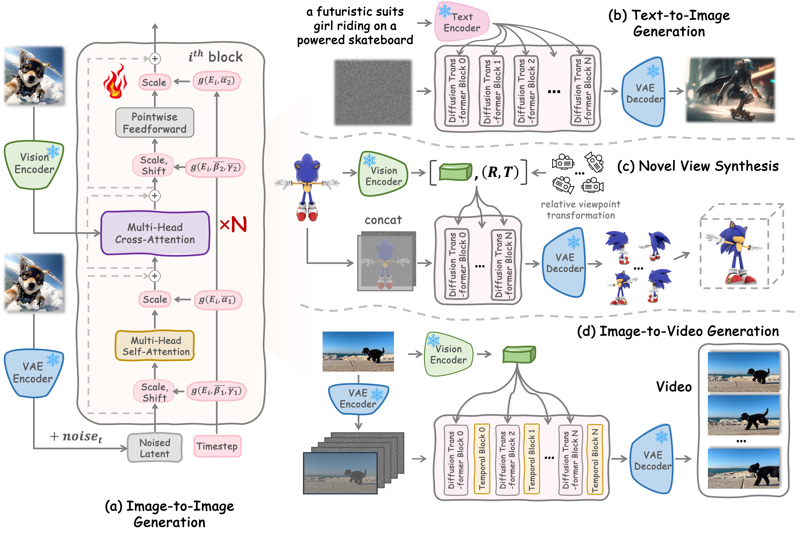

# Learning Visual Generative Priors without Text

## Method

Given image, use pre-trained AE $\mathcal{E}$ to get its latent representation $z=\mathcal{E}(x)$. Using a pre-trained encoder $\tau^{\text{image}}$ to extract its visual semnatic feature $\tau^{\text{image}}(x)$

We hope to learn image-to-image latent diffusion model $\epsilon_\theta$ via
$$
\mathcal{L}=\mathbb{E}_{x\sim\mathcal{D},z\sim\mathcal{E}(x),\epsilon,t} [\|\epsilon-\epsilon_\theta(z_t,t,\tau^{\text{image}}(x))\|^2]
$$
using DiT

Observation:
- Pure-vision visual encoder is better than language image pre-training encoder for I2I generation
- Scale up dataset can improve the performance of I2I generation (...)
- Use local features as condition decrease the difficulty of I2I generation

### Transfer Learning

Text-to-image generation: tune on I2I generation task with
$$
\mathcal{L}=\mathbb{E}_{(x,y)\sim\mathcal{D},z\sim\mathcal{E}(x),\epsilon,t} [\|\epsilon-\epsilon_\theta(z_t,t,\tau^{\text{txt}}(y))\|^2]
$$

Text-irrelevant visual generative task: prove superiority of I2I priors over T2I priors on text-irrelevant visual generative task

