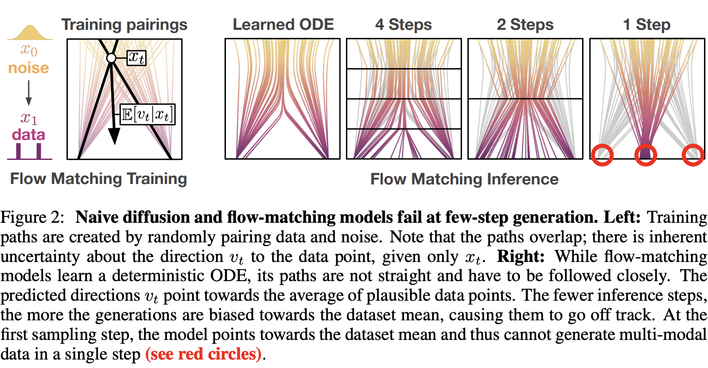
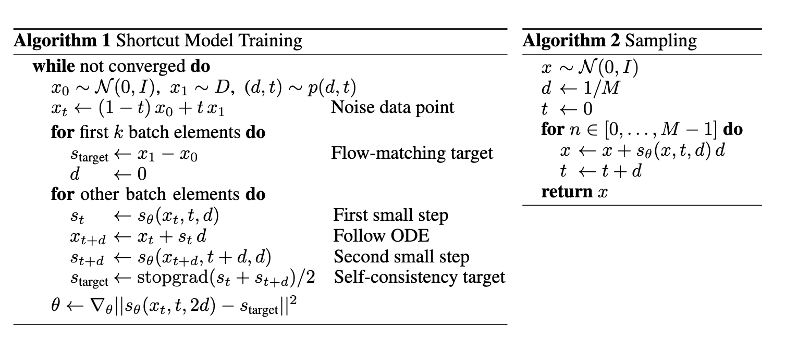

# One step diffusion via Shortcut Models

## Motivation

In diffusion and flow matching, one step generation will fall for any multi-modal distribution.

Key insight: condition NN not only on noise level but also desired step size, enabling one step generation.

## Method

In flow-matching, we aims to learn ODE that maps noise to data along curved path. By defining shortcut, we can predict $x_{t+d}$ from $x_t$ use shortcut

$$
x'_{t+d}=x_t+s(x_t, t, d)d
$$

our goal is train a shortcut model $s_{\theta}(x_t,t,d)$. When $d\to 0$, shortcut model is equivalent to flow.

How to train $s_{\theta}(x_t,t,d)$?
- One naive approach is to train $s_{\theta}(x_t,t,d)$ to fully simulate the ODE. However, this is not feasible in practice.
- Hope consistency of short cut model, i.e. $s_{\theta}(x_t,t,2d)=s_{\theta}(x_t,t,d)/2+s_{\theta}(x_{t+d}',t+d,d)/2$.

How to train shortcut model? In principle, we can train shortcut model on any distribution $d\sim p(d)$. In practice, split the training data into two parts, one for training flow ($d=0$), the other for training shortcut.

$$
\mathcal{L}^{S}(\theta)=\mathcal{E}_{t,d\sim p(t,d),x_0\sim\mathcal{N},x_1\sim D}\left[\left\|s_{\theta}(x_t,t,0)-(x_1-x_0)\right\|^2+\left\|s_{\theta}(x_t,t,2d)-s_{\text{target}}\right\|^2\right]\\
s_{\text{target}}=s_{\theta}(x_t,t,d)/2+s_{\theta}(x_{t+d}',t+d,d)/2\quad x_{t+d}'=x_t+s_{\theta}(x_t,t,d)d
$$

What does this loss guarantee?
- When $d\to 0$, $s_{\theta}(x_t,t,d)$ predict correct velocity.
- For every $d>0$, $s_{\theta}(x_t,t,d)$ is consistent with $s_{\theta}(x_t,t,2d)$.
- If assuming continuity of $s_{\theta}(x_t,t,d)$, we can get correct $s_{\theta}(x_t,t,d)$ for any $d$ with optimal $\theta$.

Algorithm:

### Train details

1. Sample $t\sim U[0,1]$, choose number of steps $M$ as samllest unit of time for approximating ODE ($M=128$ here). Possible $d\in \{1/128, 1/64, \ldots, 1\}$.
2. When $d$ is at the smallest value, we query the model at $d=0$ instead of $s_{\theta}(x_t,t,1/128)$.
3. Use more empirical targets than self-consistency targets. Construct a training batch by combining a ratio of $1-k$ empriical targets and $k$ self-consistency targets($k=0.25$ here).
4. Classifier-free guidance: see last section of [SDE](./SDE.md).
5. EMA: inherent variance in diffusion model, variance at $d=0$ results in large oscillation in $d=1$. Use EMA to stabilize training.
6. Weight decay, discrete time ($t$ is multipies of $d$).

## Experiment

1. One step generation SOTA
2. Scaling law
3. Interpolate on noise $x_0^n=nx_0^0+\sqrt{1-n^2}x_0^1$, generation display a qualitatively smooth transition