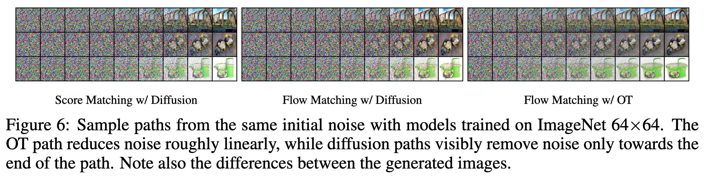

# Flow Matching for Generative Modeling

## Background

Time dependent probability density function $p_t(x)$, $\int p_t(x)dx=1$
Time dependent vector field $v$, time dependent diffeomorphic map (flow) $\phi$, satisfy ODE

$$
\frac{d}{dt}\phi_t(x)=v_t(\phi_t(x)),\quad \phi_0(x)=x
$$

we can get $p_t$ from the ODE

$$
p_t(x)=[\phi_t]_*p_0(x)=p_0(\phi_t^{-1}(x))\left|\det\left(\frac{\partial\phi_t^{-1}(x)}{\partial x}\right)\right|
$$

## Flow Matching

Let $x_1$ denote random variable following distribution $q(x_1)$. We can only sample from $q(x_1)$ but have no access the density function. We want to learn a flow from $p_0=p=\mathcal{N}(0,1)$ to $p_1\approx q$.

If we have target $p_t(x)$ and corresponding vector field $u_t(x)$, we can learn $u_t(x)$ by

$$
\mathcal{L}_{\text{FM}}(\theta)=\mathbb{E}_{t\sim\mathcal{U}[0,1],x\sim p_t(x)}\left[\|u_t(x)-v_{\theta,t}(x)\|^2\right]
$$

__However, we don't have $p_t(x)$ and $u_t(x)$.__
To solve this problem, we use __conditional probability path__.

Define $p_t(x|x_1)$ such that $p_0(x|x_1)=p(x)$, $p_1(x|x_1)=\mathcal{N}(x;x_1,\sigma^2 I)$, the marginal probability path

$$
p_t(x)=\int p_t(x|x_1)q(x_1)dx_1
$$

and when $\sigma$ is sufficiently small

$$
p_1(x)=\int p_1(x|x_1)q(x_1)dx_1\approx q(x)
$$

Notice we can define marginal vector field $u_t(x)$ by

$$
u_t(x)=\int u_t(x|x_1)\frac{p_t(x|x_1)q(x_1)}{p_t(x)}dx_1
$$

*THM: $u_t(x)$ generates $p_t(x)$* (use continuity equation)

Based upon $u_t(x|x_1)$, we can learn $u_t(x)$ by __conditional flow matching__

$$
\mathcal{L}_{\text{CFM}}(\theta)=\mathbb{E}_{t\sim\mathcal{U}[0,1],x_1\sim q(x_1),x\sim p_t(x|x_1)}\left[\|u_t(x|x_1)-v_{\theta,t}(x)\|^2\right]
$$

By expansion, it can be shown that $\mathcal{L}_{\text{CFM}}(\theta)=\mathcal{L}_{\text{FM}}(\theta)+C$.

## Conditional Probability Path and Vector Field

Based on the observation above, we find that choice of conditional probability path and vector field doesn't affect optimal $\theta$. We can choose

$$
p_t(x|x_1)=\mathcal{N}(x;\mu_t(x_1),\sigma_t^2(x_1) I)
$$

with $\mu_0(x_1)=0,\mu_1(x_1)=x_1$ and $\sigma_0(x_1)=1,\sigma_1(x_1)=\sigma_{\min}$.

How can we choose flow $\phi$ to generate $p_t(x|x_1)$?
Obviously, $\phi_t(x_0|x_1)=\mu_t(x_1)+\sigma_t(x_1)x_0$ is a good choice, the corresponding vector field is

$$
u_t(x|x_1)=\frac{\sigma_t'(x_1)}{\sigma_t(x_1)}(x-\mu_t(x_1))+\mu_t'(x_1)
$$

and loss function is

$$
\mathcal{L}_{\text{CFM}}(\theta)=\mathbb{E}_{t\sim\mathcal{U}[0,1],x_1\sim q(x_1),x_0\sim p(x_0)}\left[\|u_t(\phi_t(x_0|x_1)|x_1)-v_{\theta,t}(\phi_t(x_0|x_1))\|^2\right]
$$

### Relation to Diffusion

The reversed Variance Exploding (VE) path is

$$
p_t(x|x_1)=\mathcal{N}(x;x_1,\sigma_{1-t}^2 I)
$$

which is equivalent to setting $\mu_t(x_1)=x_1$ and $\sigma_t(x_1)=\sigma_{1-t}$, the vector field is

$$
u_t(x|x_1)=-\frac{\sigma_{1-t}'}{\sigma_{1-t}}(x-x_1)
$$

Similarly, the reversed Variance Preserving (VP) path is

$$
p_t(x|x_1)=\mathcal{N}(x;\alpha_{1-t}x_1,(1-\alpha_{1-t}^2) I)\quad \alpha_t=e^{-\frac{1}{2}\int_0^t\beta(s)ds}
$$

which is equivalent to setting $\mu_t(x_1)=\alpha_{1-t}x_1$ and $\sigma_t(x_1)=\sqrt{1-\alpha_{1-t}^2}$, the vector field is

$$
u_t(x|x_1)=\frac{\alpha'_{1-t}}{1-\alpha_{1-t}^2}(\alpha_{1-t}x-x_1)
$$

### Optimal Transport

The optimal transport path is

$$
\mu_t(x_1)=tx_1\quad \sigma_t(x)=1-(1-\sigma_{\min})t
$$

the vector field is

$$
u_t(x|x_1)=\frac{x_1-(1-\sigma_{\min})x}{1-(1-\sigma_{\min})t}
$$

the conditional flow corresponding is

$$
\phi_t(x_0|x_1)=(1-(1-\sigma_{\min})t)x_0+tx_1
$$

by optimizing CFM loss

$$
\mathcal{L}_{\text{CFM}}(\theta)=\mathbb{E}_{t\sim\mathcal{U}[0,1],x_1\sim q(x_1),x_0\sim p(x_0)}\left[\|(x_1-(1-\sigma_{\min})x_0)-v_{\theta,t}(\phi_t(x_0|x_1))\|^2\right]
$$

What is the advantage of optimal transport path? The linear relation improves training efficiency and sampling efficiency.

## Conclusion

What do we learn from flow matching?

- Flow matching is a general framework for generative modeling, NCSN and DDPM are special cases of flow matching.
- Conditional probability path and vector field are not unique, but the optimal $\theta$ is unique.
- Optimal transport path is a good choice for flow matching, it improves training efficiency and sampling efficiency.