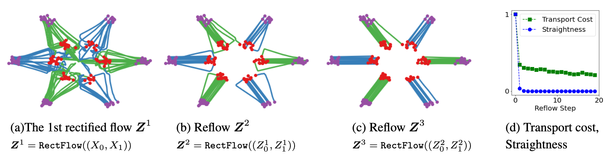

# Rectified Flow

## Background and Motivation

We want to solve Transport Mapping problem

*Give empirical observation of two distributions $X_0\sim \pi_0$ and $X_1\sim \pi_1$, find a function $f:X_0\to X_1$ such that $f(Z_0)\sim \pi_1$ for $Z_0\sim \pi_0$.*

Serveral existing solution solves the problem quite well, e.g. GAN, VAE, SDE/ODE based models, but SDE/ODE based models is computationally expensive. 
Can we do one-step generation ? Use linear drift force !

## Method

Using linear flow $X_t=t(X_1-X_0)+X_0$ to generate $X_1$ from $X_0$, we want 

$$
v(X_t=t(X_1-X_0)+X_0)=\frac{dX_t}{dt}=X_1-X_0
$$

for every $X_0,X_1,t$, using MSE loss

$$
\hat{\theta}=\arg\min_\theta\mathbb{E}_{t\in\text{Uni}[0,1]}\left[\left\|v(t(X_1-X_0)+X_0,t)-(X_1-X_0)\right\|^2\right]
$$

What will the optimal solution be ?

$$
v(X_t,t)=\mathbb{E}_{X_0\sim\pi_0,X_1\sim\pi_1,X_t=t(X_1-X_0)+X_0}\left[X_1-X_0\right]
$$

Reflow multiple times, we can get $Z_1^k$. Finally, we learn a neural network $f$ to distill the $k$-rectified flow.

__Using the flow, we can remove all intersections between $X_0$ and $X_1$.__

More details waiting for update.