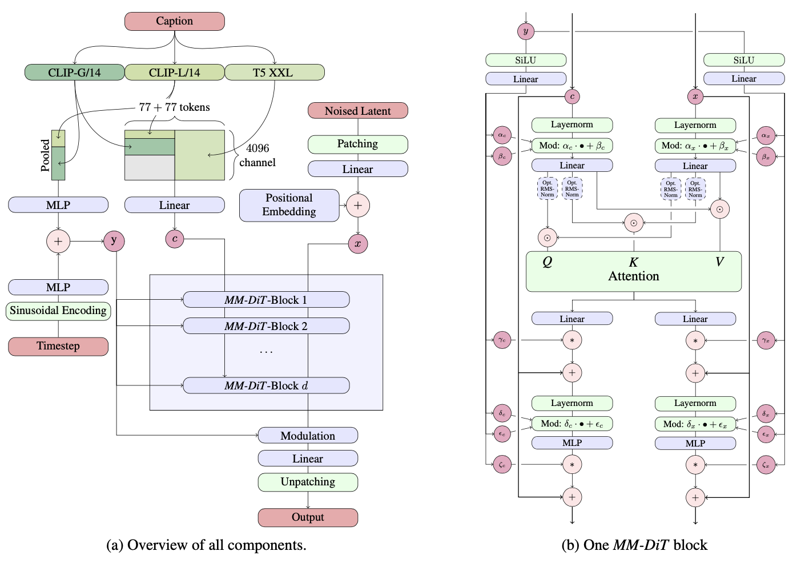

# Scaling Rectified Flow Transformers for High-Resolution Image Synthesis

## Method

### Tailored SNR Samplers for RF models

The weighted fm loss
$$
\mathcal{L}_{\text{fm}} = -\frac{1}{2}\mathbb{E}_{t\sim U(t),\epsilon\sim\mathcal{N}(0,I)}\left[w_t\lambda_t'||\epsilon_\Theta(z_t,t)-\epsilon||^2\right]
$$
by reparameterizing $\epsilon_\Theta(z_t,t)=-\frac{2}{\lambda_t'b_t}(v_\Theta-\frac{a_t'}{a_t}z)$.

In rectified flow, $z_t=(1-t)x_0+t\epsilon$ and $w_t=\frac{t}{1-t}$. However, training velocity uniformly may not be optimal, middle $t$ is harder, we can use
$$
w_t^\pi = \frac{t}{1-t}\pi(t)
$$

Logit-Normal Sampling: 
$$
\pi_{\ln}(t;m,s)=\frac{1}{s\sqrt{2\pi}}\frac{1}{t(1-t)}\exp\left(-\frac{(\log\frac{t}{1-t}-m)^2}{2s^2}\right)
$$

Mode Sampling with Heavy Tails:
$$
f_{\text{mode}}(t;s) = 1 - t - s(\cos^2(\frac{\pi}{2}t)- 1+t)\\
\pi_{\text{mode}}(t;s) = |\frac{d}{dt}f_{\text{mode}}^{-1}(t;s)|
$$

CosMap:
$$
\pi_{\text{cos}}(t) = \frac{2}{\pi-2\pi t+2\pi t^2}
$$

### MM DiT

## Experiments

Improve Rectified Flow: ablation study on different formulations

Improve Representation: 
- Increase channels of AE to 16
- Change captions to mix of original and VLM generated captions
- MM DiT performs better than baseline

Scale up:
- Filter data
- Precomputing Image and Text Embeddings

Fine-tuning on high resolution:
- QK-Normalization
- For high resolution, combine interpolated position embedding and extended position embedding
- Resolution-dependent shifting: higher resolution image need more noise to destroy the signal (theory ignore here)
$$
t_m=\frac{\sqrt{\frac{m}{n}}t_n}{1+(\sqrt{\frac{m}{n}}-1)t_n}
$$
- Finetune with DPO