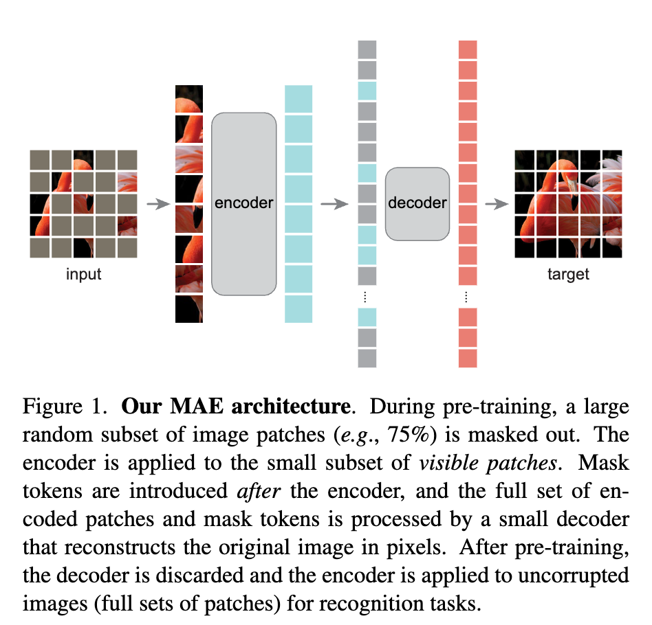
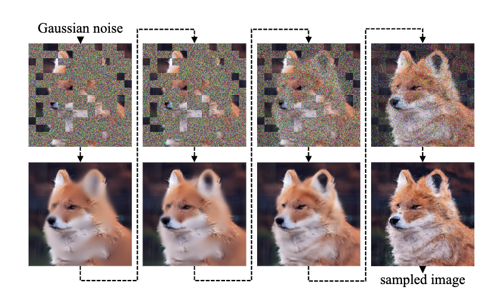

# Masked Autoencoders Are Scalable Vision Learners

## Motivation

BERT use masked autoencoding to learn features: remove a portion of data and learn to predict removed content.

What makes masked autoencoding different between vision and language?
- Conv nets operate on regular grid, not straightforward to mask or add position embeddings. 
  - Sol: ViT
- Information density of language and vision is different. A little high-level understanding of image can be enough to recover missing content. 
  - Sol: Mask high portion of random patches to make task more challenging.
- Autoencoder's decoder needs to maps the latent representation back to pixel, which is high level to low level mapping. 
  - Sol: Careful design of decoder.

## Method

MAE use asymmetric design of encoder and decoder. 

1. Masking: divide image into non-overlapping patches, sample a subset from patches
2. Encoder: linear projection of patches, add positional embeddings, remove masked patches, apply transformer encoders.
3. Decoder: combine encoded visible patches and mask tokens(one shared embedding) together, add positional embeddings, apply transformer decoders (smaller, narrower, and shallower than encoder).
4. Reconstruction: linear projection of decoder output to pixel space, compute MSE loss.

The method is really simple and elegant, but effective and scalable !

## Further Reading

### DiffMAE

MAE is a generative model, generate masked image conditioned on visible content.
Formulate the masked prediction task as conditional generative objective, we can learn model with diffusion within the framework of MAE.

Add noise to the masked image

$$
p(x_t^m|x_0^m)=\mathcal{N}(x_t^m;\sqrt{\overline{\alpha_t}}x_0^m, (1-\overline{\alpha_t})I)
$$

and denoise using loss

$$
\mathcal{L}_{\text{simple}}=\mathbb{E}_{t,x_0,\epsilon}\left[\left\|x_0^m-D_\theta(x_t^m,t,E_\phi(x_0^v))\right\|^2\right]
$$

encoder $E_\phi$ is a vit, decoder $D_\theta$ needs careful design, but also a transformer.

Inference: predict $x_0^m$ using $D_\theta(x_t^m,t,E_\phi(x_0^v))$, then add smaller noise to predicted $x_0^m$, repeat until $t=0$. When $t$ is smaller, more intricate high-frequency details are added.

Experiment shows the when $t=T$, the prediction is close to MAE.