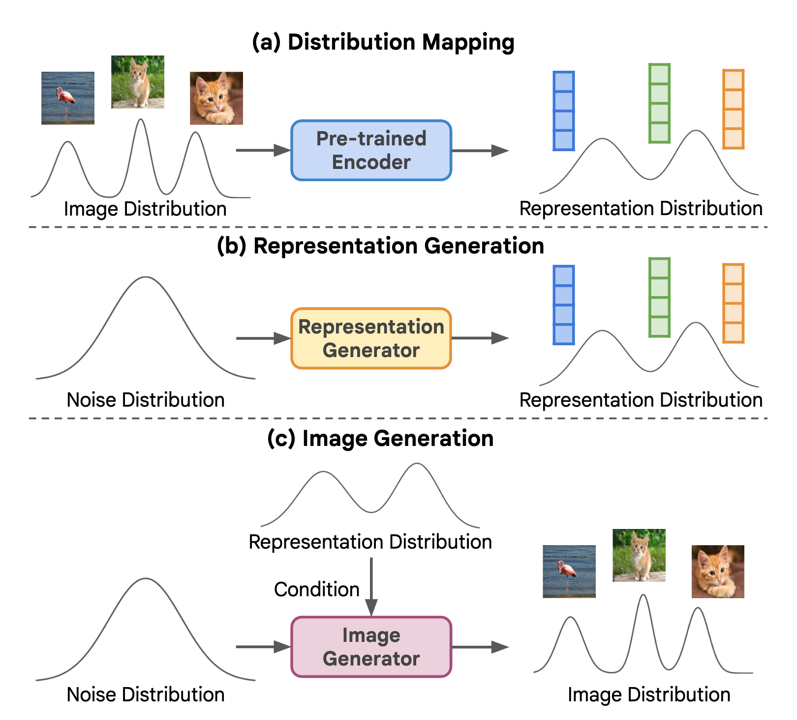

# Return of Unconditional Generation: A Self-supervised Representation Generation Method

## Motivation

Generation quality of unconditional generation is much worse than conditional generation. One reason is the lack of semantic information provided by labels.
What if we can generate semantic representations in the representation space ?

How to generate representations in the representation space ? 
Using a self-supervised encoder.

## Method

Framework: a pre-trained self-supervised encoder, a representation generator, an image generator.

- Self-supervised encoder: pre-trained on a large-scale dataset, e.g. ImageNet using MoCo v3. The representation distribution satisfies
  - Simple enough to modeled effectively by an unconditional generator
  - Rich in high-level semantic information
- Representation generator: diffusion model, generate abstract, unstructured representations
- Image generator: conditioned on self-supervised representations, genereate images from noise distribution

### Experiment

1. RCG significantly improves the unconditional generation performance of current generative models.
2. RCG largely improves the state-of-the-art in unconditional image generation.
3. RCG’s unconditional generation performance rivals leading methods in class-conditional image generation.

Using representations from a self-supervised encoder, generate higher-quality images than using class labels.

Conditioned on interpolated representations from two images, semantics of generated images gradually change.