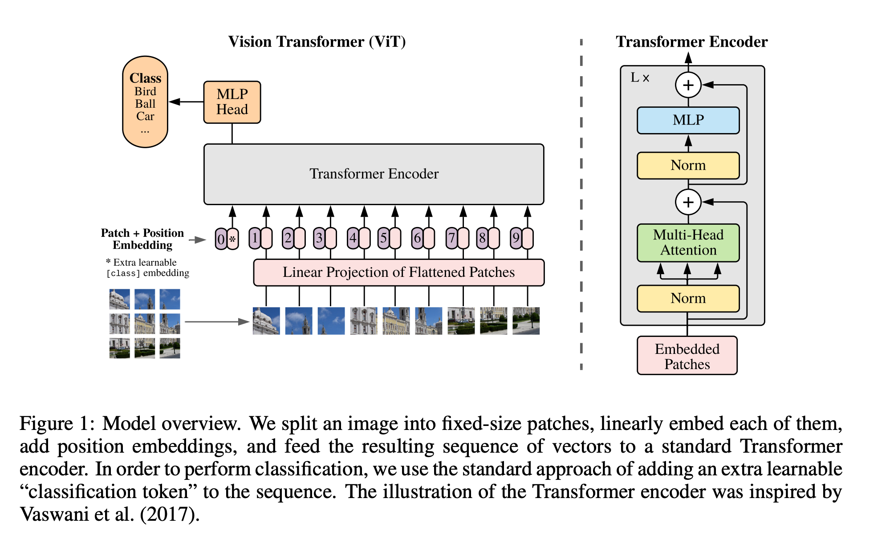
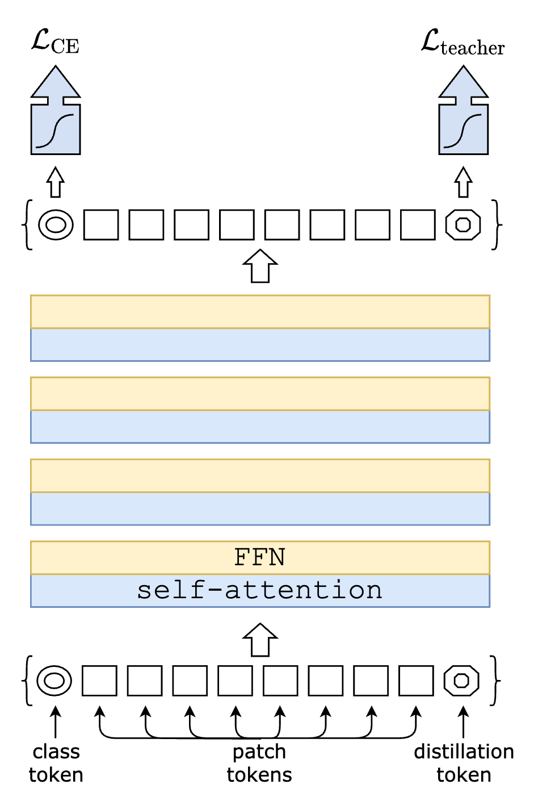

# Vision Transformer

## Motivation

Transformer outperforms on NLP tasks, why it can't be used for vision tasks?
- CNN has inductive bias for grid-like data, which contains locality and translation invariance.
- To use transformer for vision tasks, we need more data.

## Architecture

They propose Vision Transformer (ViT) which is a transformer model that can be applied directly to image patches. 
We ignore the details of the architecture with the following diagram:

Drawbacks: pretrained on extremely large datasets, too computationally expensive for many practical applications.

Can we distill the knowledge of CNN into ViT?

### Soft distillation

Define $Z_t$ and $Z_s$ as logits of teacher and student models, $\psi$ as the softmax function, $y$ as ground truth labels

$$
\mathcal{L}_{\text{distill}} = (1-\lambda) \mathcal{L}_{\text{CE}}(Z_s, y) + \lambda\tau^2 \mathcal{L}_{\text{KL}}(\psi(Z_t/\tau), \psi(Z_s/\tau))
$$

### Hard distillation

Define $y_t=\arg\max_c Z_t(c)$ be the hard decision of the teacher

$$
\mathcal{L}_{\text{distill}} = \frac{1}{2}\mathcal{L}_{\text{CE}}(\psi(Z_s), y) + \frac{1}{2}\mathcal{L}_{\text{CE}}(\psi(Z_s), y_t)
$$

hard labels can be convert into soft labels by setting true label with probability $1-\epsilon$ and other labels with $\epsilon/(C-1)$

We introduce a new __distillation token__, which employed in a similar fashion as the class token, except the objective is from the teacher model

The cosine similarity of class token and distillation token in the first layer is 0.06, and it increases to 0.93 in the last layer.
- What does this imply ? Teacher model's knowledge is almost identical to ground truth labels.

### Experiment results

Using DeiT, the accuracy of ViT increased from 77.9% to 81.8% on ImageNet, which is comparable to SOTA ConvNet based models.