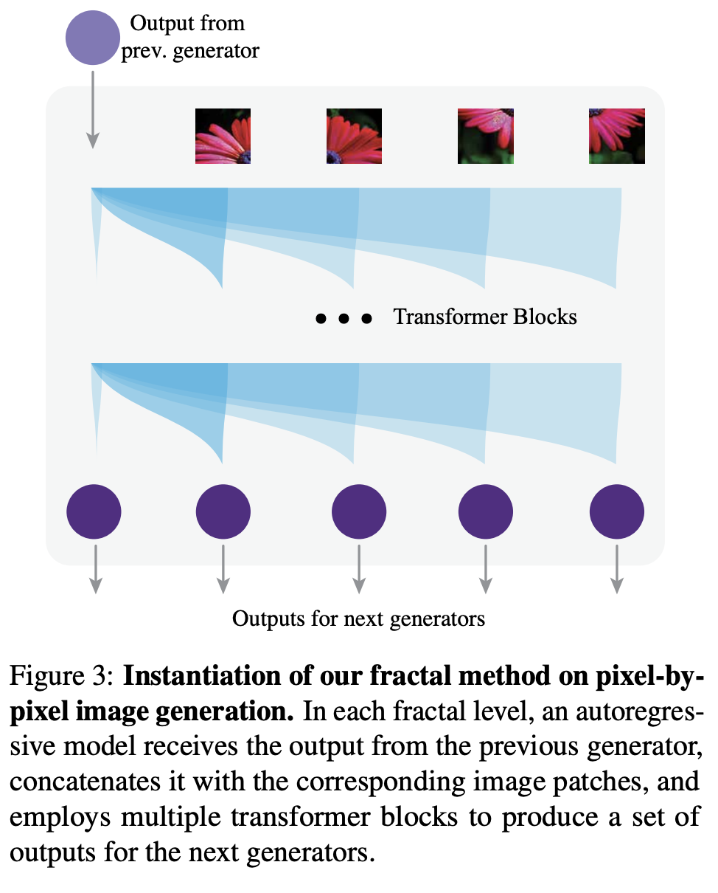

# Fractal Generative Models

Assume sequence length in each auto-regressive model is $k$, total number of random variables $N=k^n$, where $n$ is the number of recursive levels in fractal model.

Partition the joint distribution into $k$ subsets
$$
p(x_1,\dots,x_{k^n}) = \prod_{i=1}^k p(x_{(i-1)k^{n-1}+1},\dots,x_{ik^{n-1}}|x_1,\dots,x_{(i-1)k^{n-1}})
$$
each condtional distribution $p(x_{(i-1)k^{n-1}+1},\dots,x_{ik^{n-1}}|x_1,\dots,x_{(i-1)k^{n-1}})$ is modeled by autoregressive model at second level.

TLDR: receive output from the previous level, concatenate with corresponding image patches, generate the next level output.

More details finished later ...