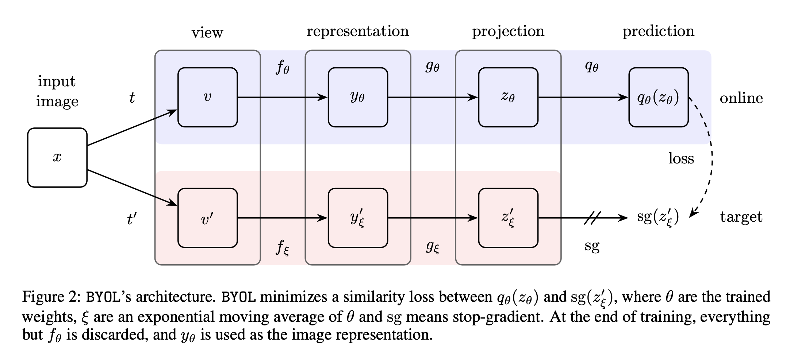

# Bootstrap Your Own Latent

Define online NN with weights $\theta$ comprised of a encoder $f_{\theta}$, projector $g_\theta$, predictor $q_\theta$
A target network with same architecture and weights $\xi$, using momentum update $\xi \leftarrow \tau \xi + (1-\tau)\theta$

1. Sample two view augmentations $t\sim T, t'\sim T'$, get two images $v=t(x),v'=t'(x)$. 
2. Compute online and target network outputs $z=g_\theta(f_\theta(v)), z'=g_\xi(f_\xi(v'))$.
3. Output predictions $p=q_\theta(z), p'=q_\xi(z')$.
4. Maximize cosine similarity between predictions $p,z'$ and $p',z$ by stopping gradients at $z,z'$.

Almost identical to SimSiam if $\tau=1$.