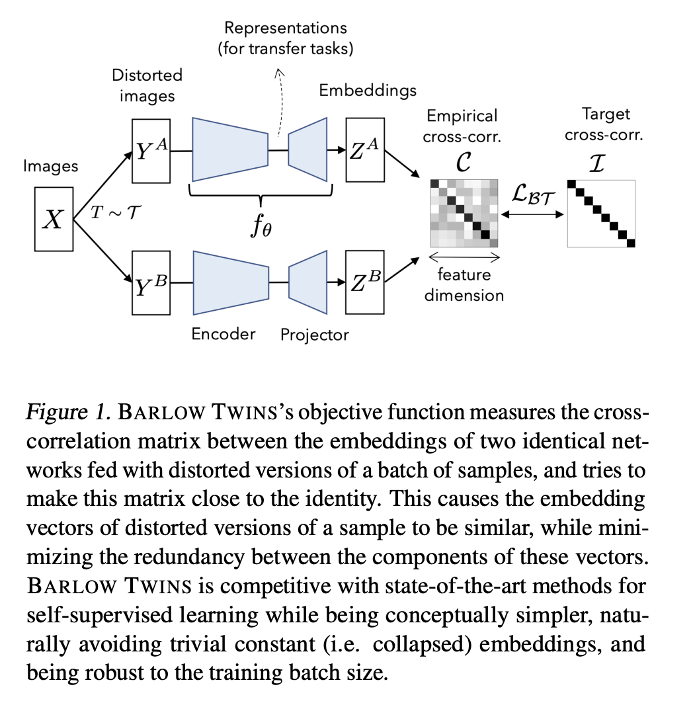

# Barlow Twins

TLDR: hopes to learn representations that are invariant to data augmentations by minimizing the cross-correlation between two augmented views of the same image.

Define cross-correlation matrix $C$ between outputs of two augmented views of the same image along batch axis as:
$$
C_{ij}=\frac{\sum_b z_{b,i}^Az_{b,j}^B}{\sqrt{\sum_b {z_{b,i}^A}^2}\sqrt{\sum_b {z_{b,j}^B}^2}}
$$
we hope to minimize the difference between $C$ and the identity matrix $I$, in order to learn representations that are invariant to data augmentations
$$
\mathcal{L} = \sum_i (1-C_{ii})^2 + \lambda \sum_{i\neq j} C_{ij}^2
$$
where $\lambda$ is a hyperparameter that controls the trade-off between invariance and informativeness.

#### Advantages:
- Doesn't require large batch sizes
- Doesn't require particular asymmetry in the network architecture
- Improve as the dimensionality of the representation increases

#### Compared with InfoNCE:

InfoNCE:
$$
\mathcal{L}=-\sum_b\frac{\langle z_b^A,z_b^B\rangle_i}{\tau\|z_b^A\|\|z_b^B\|}+\sum_b\log\sum_{b'\neq b}\exp\left(\frac{\langle z_b^A,z_{b'}^B\rangle_i}{\tau\|z_b^A\|\|z_{b'}^B\|}\right)
$$
Barlow Twins:
$$
\mathcal{L} = \sum_i (1-\frac{\langle z_{\cdot, i}^A, z_{\cdot, i}^B\rangle}{\| z_{\cdot, i}^A\|\|z_{\cdot, i}^B\|})^2 + \lambda\sum_i\sum_{i\neq j} (\frac{ z_{\cdot, i}^A, z_{\cdot, j}^B}{\|\langle z_{\cdot, i}^A\|\|z_{\cdot, j}^B\|})^2
$$

First term aims to make the embeddings invariant to data augmentations, while the second term aims to make the embeddings informative.

Difference:
- InfoNCE normalizes along feature dimension, while Barlow Twins normalizes along batch dimension
- InfoNCE use temperature $\tau$ to control the relative importance of negative samples, while Barlow Twins use $\lambda$ to control the trade-off between invariance and informativeness