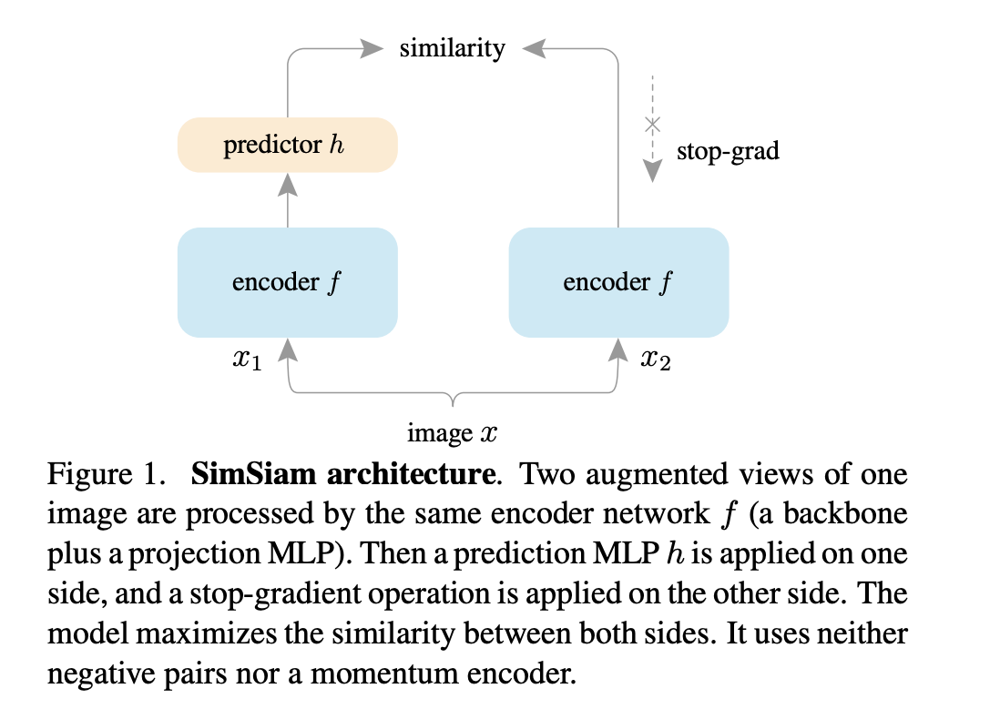

# Exploring Simple Siamese Representation Learning

Define $p_1=h(f(x_1)),z_2=f(x_2)$, negative cosine similarity loss:
$$
D(p_1,z_2)=\frac{p_1\cdot z_2}{\|p_1\|\|z_2\|}
$$
we aims to minimize symmetrized loss
$$
L=\frac{1}{2}D(p_1,z_2)+\frac{1}{2}D(p_2,z_1)
$$

## Empirical Study
- In order to find non-trivial solutions, we need to do stop-gradient on the target network $z$ (proof in paper section 5)
$$
L=\frac{1}{2}D(p_1,stopgrad(z_2))+\frac{1}{2}D(p_2,stopgrad(z_1))
$$
- Without predictor, gradient is same direction as $D(z_1,z_2)$, cause same problem as degenerate solutions.
- Too small or too large batch size will cause decrease in performance.
- Batchnorm helps increase accuracy
- Using $D(p_1,z_2)=-\text{softmax}(z_2)\log \text{softmax}(p_1)$ also works

Why stop-gradient helps avoid degenerate solutions? Consider a loss function
$$
L(\theta,\eta)=\mathbb{E}_{x,\tau}[||F_\theta(\tau(x))-\eta_x||^2]
$$
where $\tau$ is augmentation, $F_\theta$ is a neural network, $\eta_x$ is a target representation. Consider solving $\min_{\theta,\eta}L(\theta,\eta)$ by alternating optimization
1. Use SGD to update $\theta$ with fixed $\eta$, which corresponds to stop-gradient in $\eta$
2. Update $\eta_x=\mathbb{E}_\tau[F_\theta(\tau(x))]$, which can be approximated by sampling $\tau$.
Hence alternating optimization can be regarded as
$$
\theta^{t+1}=\arg\min_\theta\mathbb{E}_{x,\tau}[||F_\theta(\tau(x))-F_{\theta^t}(\tau'(x))||^2]
$$
where $\tau'$ is a new augmentation. It's same as SimSiam wo predictor. The predictor aims to approximate $\mathbb{E}_\tau[F_\theta(\tau(x))]$ better

They provide experiments to prove their point, e.g. maintain a moving average of $F_{\theta^t}(\tau'(x))$ to approximate $\mathbb{E}_\tau[F_\theta(\tau(x))]$ also works, but removing predictor will fail completely.