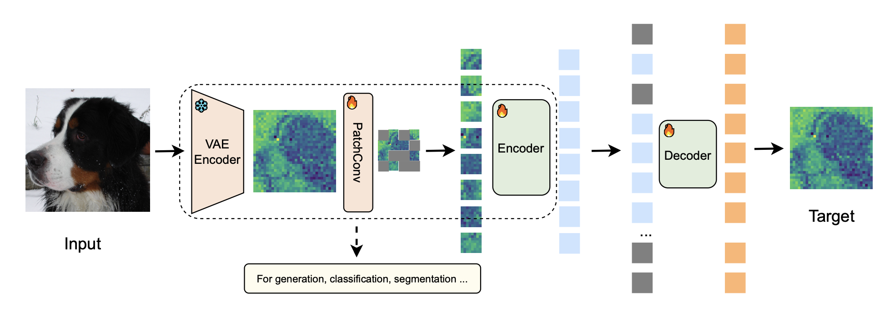

# USP: Unified Self-Supervised Pretraining for Image Generation and Understanding

## Motivation

Aims to unify pretraining-fine-tuning paradigm for both image recognition and generation

Problems:
- Input mismatch: recognition accepts clean image, diffusion model use noisy image 
- Architecture mismatch: recognition uses ViT, latent diffusion model uses VAE
- Divergent Loss and label formats

Solutions:
- Robustness of Neural Networks
- Discriminative Representations in Diffusion Models
- Adaptability of Modified ViT Architectures
- Strong Compression and Reconstruction Capabilities of VAEs

## Method

Almost same as MAE in latent, except PatchConv, use MSE loss

### Application

- Image Recognition: initialize weights using pre-trained PatchConv and Encoder, reuse class-token for classification
- Image Generation: adjust network to ensure consistency between pre-trained ViT and DiT/SiT