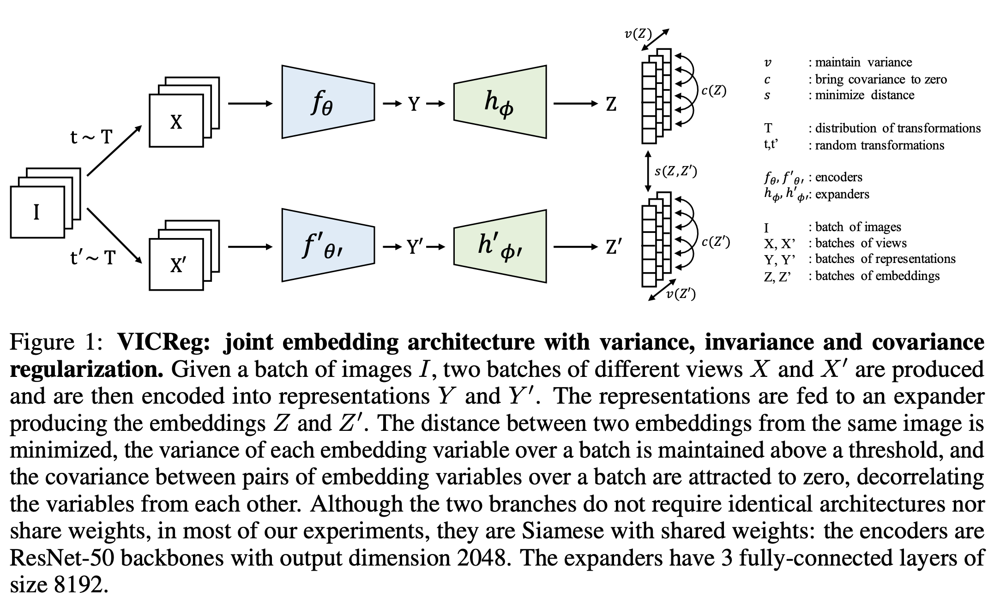

# VICReg

1. Sample an image $i$ from dataset $D$, two transformations $t,t'$ from $T$, $x=t(i),x'=t'(i)$.
2. Encode by $f_\theta$, $y=f_\theta(x),y'=f_\theta(x')$.
3. Map $y$ by expander $h_\phi$ onto embedding $z=h_\phi(y),z'=h_\phi(y')$.
4. Denote $Z=[z_1,...,z_N],Z'=[z'_1,...,z'_N]$, $z^j$ as $j$-th row of $Z$. Define variance regularization 
$$v(Z)=\frac{1}{d}\sum_{j=1}^d\max(0,\gamma-\sqrt{Var(z^j)+\epsilon})$$
        and covariance regularization as $c(Z)=\frac{1}{d}\sum_{i\neq j}[Cov(z^i,z^j)]^2$, invariance regularization as $s(Z,Z')=\frac{1}{d}\sum_{j=1}^d\|z^j-z'^j\|^2$.

5. Compute loss $L(Z,Z')=\lambda s(Z,Z')+\mu[v(Z)+v(Z')]+\nu[c(Z)+c(Z')]$.