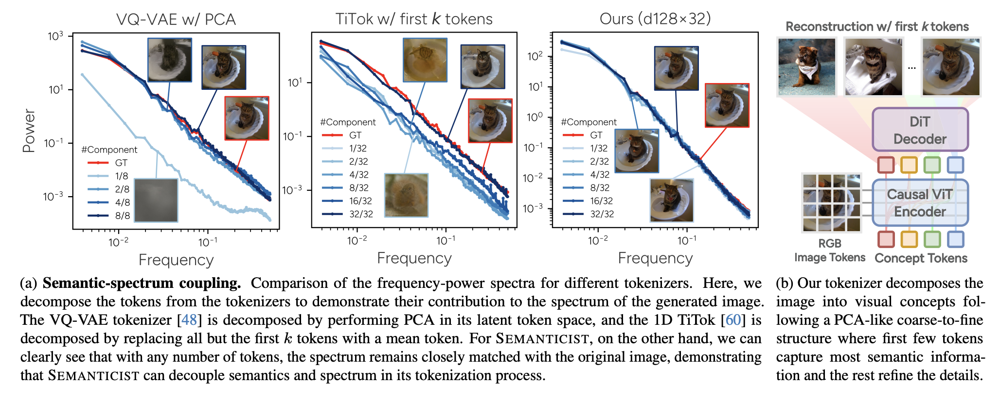

# “Principal Components” Enable A New Language of Images

## Motivation

2D latent space achieves high reconstruction quality, but hard to scale up. 
Can we reintroduce a PCA-like structure, including orthogonality and orderliness, to implement 1D latent tokens (token importance decreases) ?

## Method

Goal: require encoder $\mathbb{R}^{H\times W\times C}\to \mathbb{R}^{K\times D}$

Encode the input image $x_0$ into a sequence of patches $X_{\text{patch}}$, random init a set of concept tokens $X_{\text{concept}}=\{z_1,\dots,z_K\}$. Process
$$
X = [X_{\text{cls}}, X_{\text{patch}}, X_{\text{concept}}]
$$
through a transformer encoder, apply causal masking to $X_{\text{concept}}$ to enforce causally ordered latent tokens.

Feed output concept tokens $Z_{\text{concept}}$ to diffusion-based decoder $D$ to generate image. With CFG technique $N: \mathbb{R}^{K\times D}\to \mathbb{R}^{K\times D}$, we minimize the reconstruction loss
$$
\mathcal{L}_{\text{recon}} = \mathbb{E}_{x_0, \epsilon}\left[\left\|D(x_t, N(Z_{\text{concept}}), t) - \epsilon\right\|^2\right]
$$
$D$ implemented by DiT, inject condition $Z_{\text{concept}}$ use cross-attention.

### Nested CFG

$$
N: \mathbb{R}^{K\times D}\times \{1,\dots,K\}\to \mathbb{R}^{K\times D}
$$

Sample an integer $k'\sim U(1,K)$, apply $N$ to $Z_{\text{concept}}$ and $k'$ as follows
$$
N(Z_{\text{concept}}, k') = (z_1,\dots,z_{k'-1}, z_{\emptyset}, \dots, z_{\emptyset})
$$
where $z_{\emptyset}$ is the learnable token.

### Training

With learned latent token sequence $X_{\text{concept}}$, we can train an autoregressive model to generate images.
From previous token $z_{<k}$ and class $c$, predict the next condition token $m_k=G(z_{<k}, c)$, then denoise condition on $m_k$ using a small diffusion MLP $M$
$$
\mathcal{L}_{G} = \mathbb{E}_{z_k^0, \epsilon, t}\left[\left\|\epsilon - M(z_k^t, t, G(z_{<k}, c), t)\right\|^2\right]
$$

## Experiment

Achieve SOTA rFID, consistent with different number of tokens

